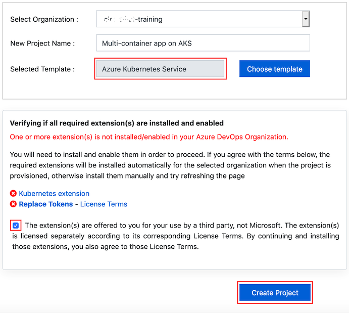
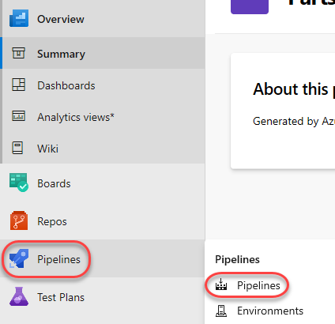
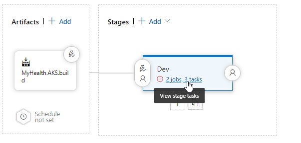
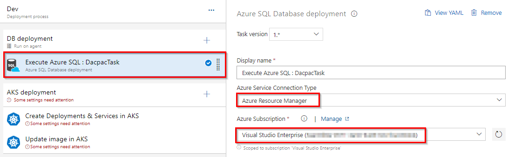
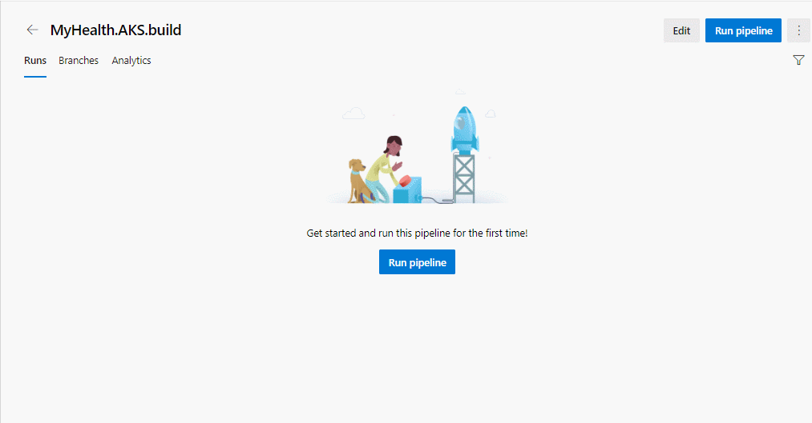

# Overview

[Azure Kubernetes Service](https://azure.microsoft.com/en-us/services/kubernetes-service/) (AKS) is the quickest way to use Kubernetes on **Azure. Azure Kubernetes Service** (AKS) manages your hosted Kubernetes environment, making it quick and easy to deploy and manage containerized applications without container orchestration expertise. It also eliminates the burden of ongoing operations and maintenance by provisioning, upgrading, and scaling resources on demand, without taking your applications offline. Azure DevOps helps in creating Docker images for faster deployments and reliability using the continuous build option.

One of the biggest advantage to use AKS is that instead of creating resources in cloud you can create resources and infrastructure inside Azure Kubernetes Cluster through Deployments and Services manifest files.

# Lab Scenario

This lab uses a Dockerized ASP.NET Core web application - **MyHealthClinic (MHC)** and is deployed to a **Kubernetes** cluster running on **Azure Kubernetes Service** (AKS) using **Azure DevOps**.

There is a `mhc-aks.yaml` manifest file which consists of definitions to spin up Deployments and Services such as **Load Balancer** in the front and **Redis Cache** in the backend. The MHC application will be running in the mhc-front pod along with the Load Balancer.

The following image will walk you through all the steps explained in this lab


If you are new to Kubernetes, [click here](https://www.azuredevopslabs.com/labs/vstsextend/kubernetes/documentation/) for description of terminology used in this lab.

# What’s covered in this lab

The following tasks will be performed:

- Create an Azure Container Registry (ACR), AKS and Azure SQL server

- Provision the Azure DevOps Team Project with a .NET Core application using the Azure DevOps Demo Generator tool.

- Configure application and database deployment, using Continuous Deployment (CD) in the Azure DevOps

- Initiate the build to automatically deploy the application

>  Want additional learning? Check out the [Automate multi-container Kubernetes deployments](https://docs.microsoft.com/en-us/learn/modules/deploy-kubernetes/) module on Microsoft Learn.

# Before you begin

1. Refer the [Getting Started](https://www.azuredevopslabs.com/labs/vstsextend/Setup/) page to know the prerequisites for this lab.

2. Click the [Azure DevOps Demo Generator](http://azuredevopsdemogenerator.azurewebsites.net/?TemplateId=77372&Name=AKS) link and follow the instructions in [Getting Started](https://www.azuredevopslabs.com/labs/vstsextend/Setup/) page to provision the project to your **Azure DevOps**.

For this lab the **Azure Kubernetes Service template** is used which is already selected when you click on the link above. There are some additional extensions required for this lab and can be automatically installed during the process.



# Setting up the environment

The following azure resources need to be configured for this lab:


1. Launch the [Azure Cloud Shell](https://docs.microsoft.com/en-in/azure/cloud-shell/overview) from the Azure portal and choose Bash.

2. Deploy Kubernetes to Azure, using CLI:

   I. Get the latest available Kubernetes version in your preferred region into a bash variable. Replace `<region>` with the region of your choosing, for example eastus.

   #### Bash

   ```
   version=$(az aks get-versions -l <region> --query 'orchestrators[-1].orchestratorVersion' -o tsv)
   ```

   II. Create AKS using the latest version available

   #### Bash

   ```

   az aks create --resource-group akshandsonlab --name <unique-aks-cluster-name> --enable-addons monitoring --kubernetes-version $version --generate-ssh-keys --location <region>

   ```

> Important: Enter a unique AKS cluster name. AKS name must contain between 3 and 31 characters inclusive. The name can contain only letters, numbers, and hyphens. The name must start with a letter and must end with a letter or a number. The AKS deployment may take 10-15 minutes

3. Deploy Azure Container Registry(ACR): Run the below command to create your own private container registry using Azure Container Registry (ACR).

   #### Bash

   ```
   az acr create --resource-group akshandsonlab --name <unique-acr-name> --sku Standard --location <region>
   ```

> **Important**: Enter a unique ACR name. ACR name may contain alpha numeric characters only and must be between 5 and 50 characters

4. **Grant AKS-generated Managed Identity access to ACR** : Authorize the AKS cluster to connect to the Azure Container Registry using the AKS generated Managed Identity. `Replace the variables $AKS_RESOURCE_GROUP, $AKS_CLUSTER_NAME, $ACR_RESOURCE_GROUP` with appropriate values below and run the commands.

   ### I. Get the id of the Managed Identity configured for AKS

   #### Bash

   ```
   CLIENT_ID=$(az aks show --resource-group $AKS_RESOURCE_GROUP --name $AKS_CLUSTER_NAME --query "identityProfile.kubeletidentity.clientId" --output tsv)
   ```

   ### II. Get the ACR registry resource id

   #### Bash

   ```
   ACR_ID=$(az acr show --name $ACR_NAME --resource-group $ACR_RESOURCE_GROUP --query "id" --output tsv)
   ```

   ### III. Create role assignment

   #### Bash

   ```
   az role assignment create --assignee $CLIENT_ID --role acrpull --scope  $ACR_ID

   ```

For more information see document on how to [Authenticate with Azure Container Registry from Azure Kubernetes Service](https://docs.microsoft.com/en-us/azure/container-registry/container-registry-auth-aks)

5. Create Azure SQL server and Database:

   ### I. Create an Azure SQL server.

   #### Bash

   ```
   az sql server create -l <region> -g akshandsonlab -n    <unique-sqlserver-name> -u sqladmin -p P2ssw0rd1234
   ```

   ### II. Create a database

   #### Bash

   ```
   az sql db create -g akshandsonlab -s <unique-sqlserver-name> -n mhcdb   --service-objective S0
   ```

> Important: Enter a unique SQL server name. Since the **Azure SQL Server name does not support UPPER / Camel casing naming conventions, use lowercase for the SQL Server Name field value.**

6. The following components - **Container Registry, Kubernetes Service, SQL Server** along with **SQL Database** are deployed. Access each of these components individually and make a note of the details which will be used in Exercise 1.

   

7. Select the `**mhcdb**` SQL database and make a note of the `**Server name**`.

   

8. Click on “Set server Firewall” and enable “Allow Azure services …” option.

   

9. Navigate to the resource group, select the created container registry and make a note of the **Login server name**.

   

Now you have all the required azure components to follow this lab.

# Exercise 1: Configure Build and Release pipeline

Make sure that you have created the AKS project in your Azure DevOps organization through [Azure DevOps Demo Generator](http://azuredevopsdemogenerator.azurewebsites.net/?TemplateId=77372&Name=AKS) (as mentioned in pre-requisites). We will manually map Azure resources such as AKS and Azure Container Registry to the build and release definitions.

1. Navigate to **Pipelines** –> **Pipelines**.

   

2. Select **MyHealth.AKS.Build** pipeline and click **Edit**.

   

3. In **Run services** task, select your **Azure subscription** from **Azure subscription dropdown**. Click **Authorize**.

   

   I. You will be prompted to authorize this connection with Azure credentials. Disable pop-up blocker in your browser if you see a blank screen after clicking the OK button, and please retry the step.

   This creates an **Azure Resource Manager Service Endpoint**, which defines and secures a connection to a Microsoft Azure subscription, using **Service Principal Authentication (SPA)**. This endpoint will be **used to connect Azure DevOps and Azure**.

   > Tip: If your subscription is not listed or to specify an existing service principal, follow the Service Principal creation instructions.

4. Following the successful authentication, select appropriate values from the dropdown - **Azure subscription** and **Azure Container Registry** as shown.

   **Repeat this step** for the tasks in the pipeline:

   1. Run services
   2. Build services
   3. Push services
   4. Lock services

   

   

**applicationsettings.json** file contains details of the database connection string used to connect to Azure database which was created in the beginning of this lab.

**mhc-aks.yaml** manifest file contains configuration details of **deployments**, **services** and **pods** which will be deployed in **Azure Kubernetes Service**. The manifest file will look like as below


5. Click on the **Variables** tab.

   

   I. Update **ACR** and **SQLserver** values for **Pipeline Variables** with the details noted earlier while configuring the environment.
   

6. **Save** the changes.

   

   Navigate to the **Repos** click on **Files** then click on **mhc-aks.yaml** then click the **Edit** button edit the image on **line 98** and then commit changes.

   

7. Make sure to change image to point to your acr `<yourarcnamehere>.azurecr.io/myhealth.web:latest`

   ```Yaml
   apiVersion: apps/v1
   
   kind: Deployment
   
   metadata:
   
     name: mhc-back
     labels:
       app: mhc-back
   spec:
   
     replicas: 1
     selector:
       matchLabels:
         app: mhc-back
     template:
   
       metadata:
   
         labels:
   
           app: mhc-back
   
       spec:
   
         containers:
   
         - name: mhc-back
   
           image: redis
   
           ports:
   
           - containerPort: 6379
   
             name: redis
   
   ---
   
   apiVersion: v1
   
   kind: Service
   
   metadata:
   
     name: mhc-back
   
   spec:
     type: ClusterIP
     ports:
   
     - port: 6379
   
     selector:
   
       app: mhc-back
   
   ---
   
   apiVersion: apps/v1
   
   kind: Deployment
   
   metadata:
   
     name: mhc-front
   
   spec:
   
     replicas: 1
   
     strategy:
       type: RollingUpdate
       rollingUpdate:
   
         maxSurge: 1
   
         maxUnavailable: 1
   
     minReadySeconds: 5
     selector:
       matchLabels:
         app: mhc-front
     template:
   
       metadata:
   
         labels:
   
           app: mhc-front
   
       spec:
   
         containers:
   
         - name: mhc-front
   
           image: akshandsonlabacr001.azurecr.io/myhealth.  web:latest
   
           imagePullPolicy: Always
   
           ports:
   
           - containerPort: 80
   
           resources:
   
             requests:
   
               cpu: 250m
   
             limits:
   
               cpu: 500m
   
           env:
   
           - name: REDIS
   
             value: "mhc-back"
   
   ---
   
   apiVersion: v1
   
   kind: Service
   
   metadata:
   
     name: mhc-front
   
   spec:
   
     type: LoadBalancer
   
     ports:
   
     - port: 80
   
     selector:
       app: mhc-front
   ```

For more information on the deployment manifest, see [AKS Deployments and YAML manifests](https://docs.microsoft.com/en-us/azure/aks/concepts-clusters-workloads#deployments-and-yaml-manifests)


8. **Navigate to Pipelines** | **Releases**. Select **MyHealth.AKS.Release pipeline** and click **Edit**.

   

9. Select Dev stage and click **View stage tasks** to view the pipeline tasks.

   

10. In the **Dev** environment, under the **DB deployment** phase, select **Azure Resource Manager** from the drop down for **Azure Service Connection** Type, update the **Azure Subscription** value from the dropdown for **Execute Azure SQL: DacpacTask** task.

    

11. In the **AKS deployment phase**, select **Create Deployments & Services** in AKS task.

    

    I. Update the Azure Subscription, Resource Group and Kubernetes cluster from the dropdown. Expand the Secrets section and update the parameters for Azure subscription and Azure container registry from the dropdown.

    

    II. Repeat similar steps for **Update image in AKS** task.

    

- **Create Deployments & Services** in AKS will create the deployments and services in AKS as per the configuration specified in mhc-aks.yaml file. The Pod, for the first time will pull up the latest docker image.

- **Update image in AKS** will pull up the appropriate image corresponding to the BuildID from the repository specified, and deploys the docker image to the **mhc-front pod** running in AKS.

- A secret called **mysecretkey** is created in AKS cluster through Azure DevOps by using command kubectl create secret in the background. This secret will be used for authorization while pulling myhealth.web image from the Azure Container Registry.

12. Select the **Variables** section under the release definition, update **ACR** and **SQL server** values for **Pipeline Variables** with the details noted earlier while configuring the environment. Select the Save button.

> Note: The **Database Name** is set to **mhcdb** and the **Server Admin Login is sqladmin** and Password is P2ssw0rd1234. If you have entered different details while creating Azure SQL server, update the values accordingly
> releasevariables

# Exercise 2: Trigger a Build and deploy application

In this exercise, let us trigger a build manually and upon completion, an automatic deployment of the application will be triggered. Our application is designed to be deployed in the pod with the **load balancer** in the front-end and **Redis cache** in the back-end.

1. Select MyHealth.AKS.build pipeline. Click on Run pipeline

   

2. Once the build process starts, select the build job to see the build in progress.

   

3. The build will generate and push the docker image to ACR. After the build is completed, you will see the build summary. To view the generated images navigate to the Azure Portal, select the **Azure Container Registry** and navigate to the **Repositories**.

   

4. Switch back to the Azure DevOps portal. Select the **Releases** tab in the Pipelines section and double-click on the latest release. Select **In progress** link to see the live logs and release summary.

   

   

5. Once the release is complete, launch the Azure Cloud Shell and run the below commands to see the pods running in AKS:
   [https://docs.microsoft.com/en-in/azure/cloud-shell/overview](https://docs.microsoft.com/en-in/azure/cloud-shell/overview)
   I. Type az **aks get-credentials --resource-group yourResourceGroup --name yourAKSname** in the command prompt to get the access credentials for the Kubernetes cluster. Replace the variables **yourResourceGroup** and **yourAKSname** with the actual values.

   #### Bash

   ```
      az aks get-credentials --resource-group yourResourceGroup --name    yourAKSname
   ```

   

   II. kubectl get pods

   #### Bash

   ```
   kubectl get pods
   ```

   

   The deployed web application is running in the displayed pods.

6. To access the application, run the below command. If you see that **External-IP** is pending, wait for sometime until an IP is assigned.

   #### Bash

   ```
   kubectl get service mhc-front --watch
   ```

   

7. Copy the **External-IP** and paste it in the browser and press the Enter button to launch the application.

   

## Kubernetes resource view in the Azure portal (preview)

The Azure portal includes a Kubernetes resource viewer (preview) for easy access to the Kubernetes resources in your Azure Kubernetes Service (AKS) cluster. Viewing Kubernetes resources from the Azure portal reduces context switching between the Azure portal and the kubectl command-line tool, streamlining the experience for viewing and editing your Kubernetes resources. The resource viewer currently includes multiple resource types, such as deployments, pods, and replica sets.

The Kubernetes resource view from the Azure portal replaces the AKS dashboard add-on, which is set for deprecation.

resource review

More information found at: https://docs.microsoft.com/en-us/azure/aks/kubernetes-portal

## Summary

[Azure Kubernetes Service](https://azure.microsoft.com/en-us/services/container-service/) (AKS) reduces the complexity and operational overhead of managing a Kubernetes cluster by offloading much of that responsibility to the Azure. With Azure DevOps and Azure Container Services (AKS), we can build DevOps for dockerized applications by leveraging docker capabilities enabled on Azure DevOps Hosted Agents.

## Reference

Thanks to Mohamed Radwan for making a video on this lab. You can watch the following video that walks you through all the steps explained in this lab:
https://youtu.be/4DUhc0MjdUc
