# Setting Up Your Envorinment for labs

[Azure Portal](https://ms.portal.azure.com/#home)

Lets get started setting up your envorinment for the labs.

## PIIM UP Your Resource Group

1. Login with AZ account

2. Open Azure AD Privileged Identity Management.

3. Select My roles.

4. Select Azure resource to see a list of your eligible resources and their corresponding roles.

5. In the Eligible roles list, find the role and the resource group you want to activate.

6. Select Activate to open the Activate pane. Scope specifies the access level. It's a best practice to only request access to the resources you need. If necessary, specify a custom activation start time. The member would be activated after the selected time.

7. In the Reason box, enter the reason for the activation request.

8. Select Activate. If the role doesn't require approval, it proceeds to activation.

9. For Resource group to be visisble, Ensure subscriptions are selected under "Global Subscriptions Filter". See -
   [GlobalSubscriptionsFilter](https://confluence.gapinc.com/display/GIIS/Azure+PIM#AzurePIM-GlobalSubscriptionsFilter)

## Setup you Bash with Storage account

1. After AZ account PIM up for owner role to Exploratorium AKS Lab RG, click on the bash shell .

   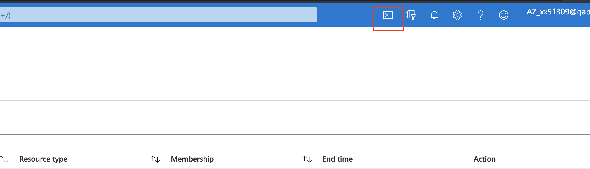

2. On the create storage account screen, click on the Advance Settings.
   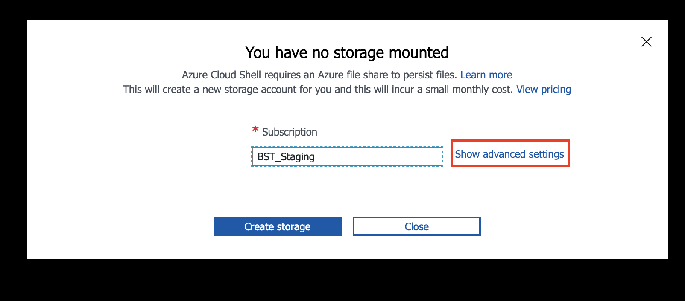

3. On the advanced setting screen, enter the below values -

   a. Subscription -

   b. Resource Group: g-rsg-2e-exploratorium01-akslab-<AD_ID>
   c. Cloud Shell Region: East US.

   d. Storage Account: sa<AD*ID>. (Please note, no - or * or space).

   e. File Share: fs<AD*ID> (Please note, no - or * or space).......

   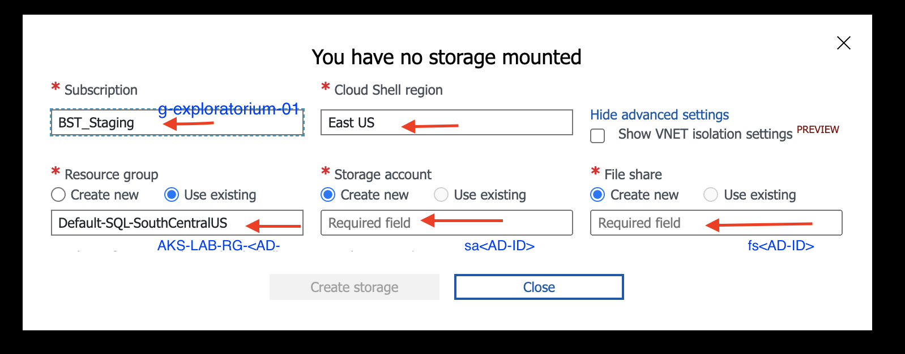

## Create your Azure Monitoring Workspace

1. Create your Monitoring workspace run the the below command in your Azure Cloud Shell Bash console.

```console
az monitor log-analytics workspace create --resource-group g-rsg-2e-exploratorium01-akslab-<aduseraccout> --workspace-name DefaultResourceGroup-<aduseraccount>
```

2. You should see something something like this after the command completes:

   ```console
   {- Finished ..
     "customerId": "e3685d78-aca3-4b9b-a6cd-48a6e0cbd7e0",
     "eTag": null,
     "id": "/subscriptions/a6176bbc-9f14-487d-817a-03320edcf127/  resourcegroups/g-rsg-2e-exploratorium01-akslab-oholtz/  providers/microsoft.operationalinsights/workspaces/  defaultresourcegroup-eusomari",
     "location": "eastus",
     "name": "DefaultResourceGroup-EUSomari",
     "privateLinkScopedResources": null,
     "provisioningState": "Succeeded",
     "publicNetworkAccessForIngestion": "Enabled",
     "publicNetworkAccessForQuery": "Enabled",
     "resourceGroup": "g-rsg-2e-exploratorium01-akslab-oholtz",
     "retentionInDays": 30,
   ```

3. Copy the Id to the clip board paste in your local text editor you will need it again to `--enable-addons monitoring` when creating the aks cluster for day 1 and day 3 Labs.

   ```Console
   "id": "/subscriptions/a6176bbc-9f14-487d-817a-03320edcf127/ resourcegroups/g-rsg-2e-exploratorium01-akslab-oholtz/providers/   microsoft.operationalinsights/workspaces/ defaultresourcegroup-eusomari",
     "location": "eastus"
   ```

4. When you create your Azure Kubernetes Cluster you will use the id from the output of the above command.

   ```Console
   az aks create --resource-group   g-rsg-2e-exploratorium01-akslab-oholtz --name okscluster   --enable-addons monitoring --kubernetes-version $version   --generate-ssh-keys --location eastus --workspace-resource-id /  subscriptions/a6176bbc-9f14-487d-817a-03320edcf127/  resourcegroups/g-rsg-2e-exploratorium01-akslab-oholtz/providers/ microsoft.operationalinsights/workspaces/  defaultresourcegroup-eusomari

   ```

## Create your own Organization for the labs is Azure DevOps

1. Navigate to Gaps Azure Devops [click here](https://dev.azure.com/) and then under Already have an account? click on `Sign in to Azure DevOps >`

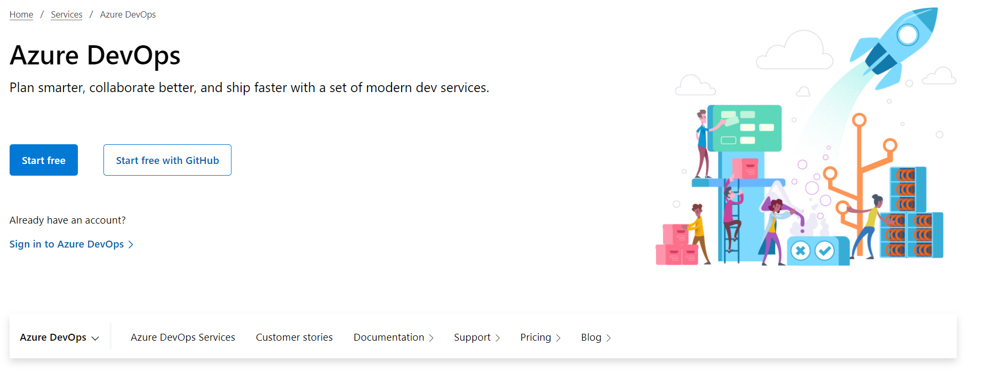

2. Click on `New Organization`.

   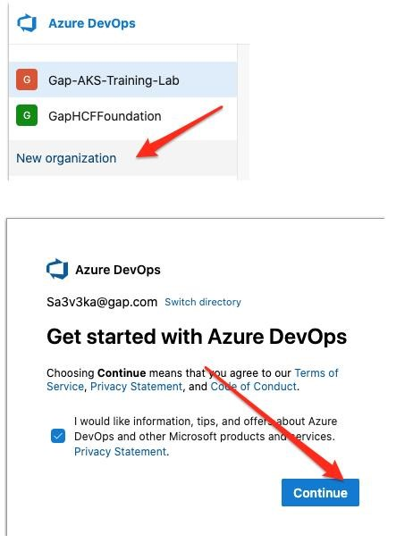

3. Provide new DevOps organization name.

   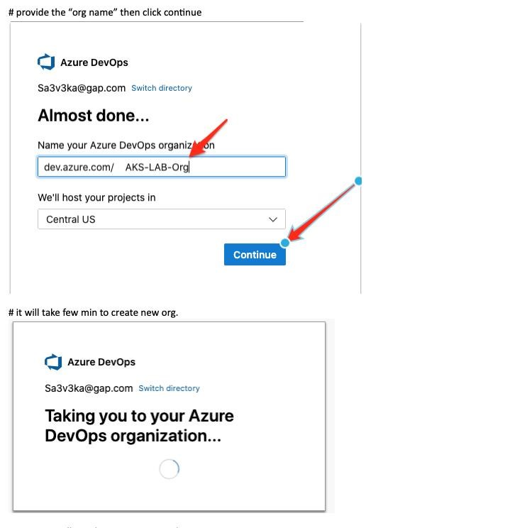

4. Now you will see your new DevOps organization.

   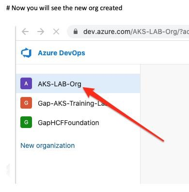

## Service Connection in DevOps

1. Select the Org.
2. Select the Project under your Org.

   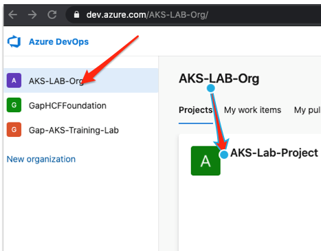

3. Click the Project Settings ( Left bottom corner in ADO project page)

   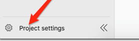

4. Select the “service connections” under Project settings.

   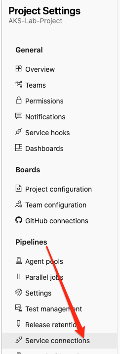

5. click create service connection.

   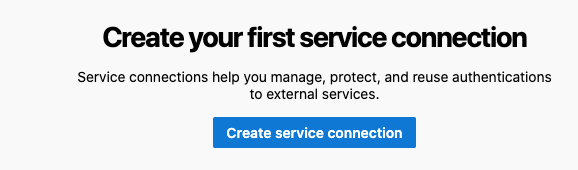

6. Select “Azure Resource Manager” then click Next.

   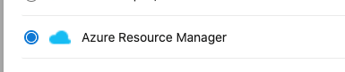

7. Select “service principal(manual) then click Next.

   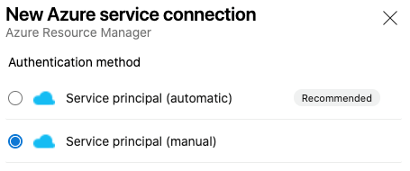

8. Update the file with below details & click “verify”.

   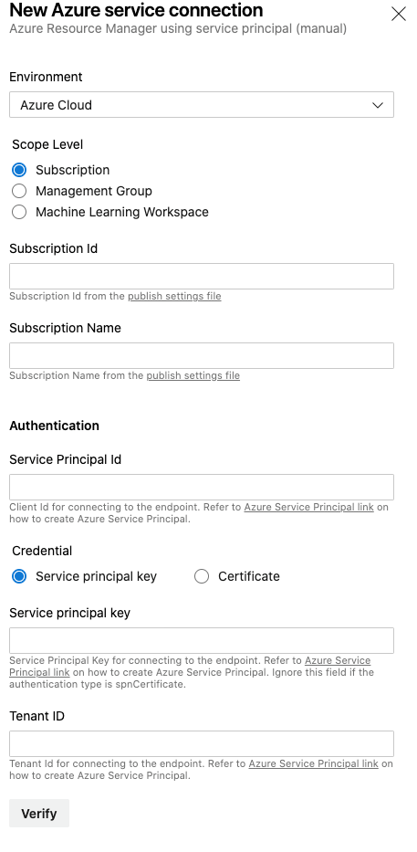

9. Once Verify success then provide the connection name & click.

   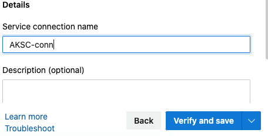

   ## Clean Resources from Azure Portal after completing the Lab

   > WARNING DO NOT DELETE YOUR RESOURCE GROUP

10. Delete everything inside the your resource group accept for your `storage account` and your monitoring `workspace` we need to leave those to resources in our resource group.

    > :skull: DO NOT DELETE YOUR RESOURCE GROUP!

    > :skull: DO NOT DELETE YOUR STORAGE ACCOUNT!

    > :skull: DO NOT DELETE YOUR AZURE MONITOR WORKSPACE!
