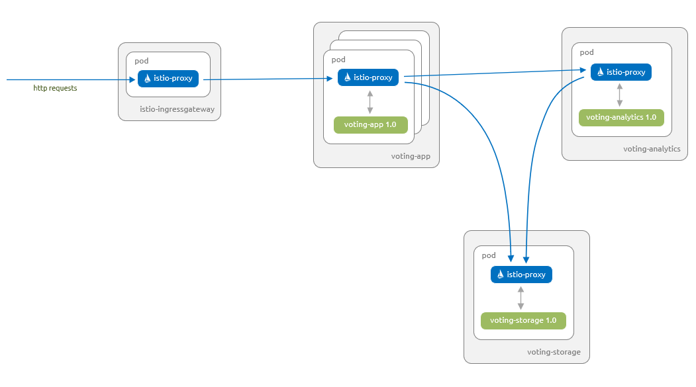
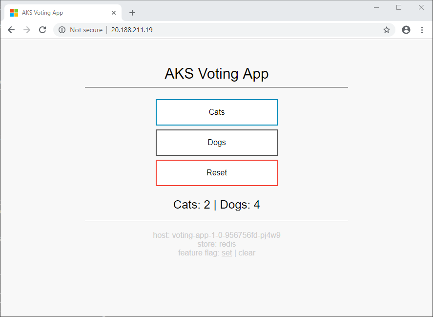
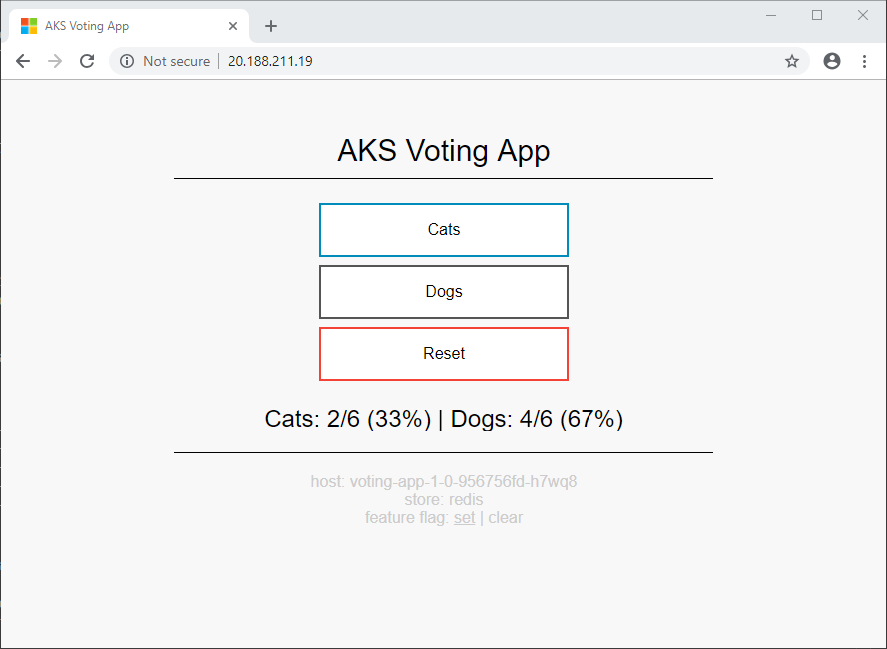
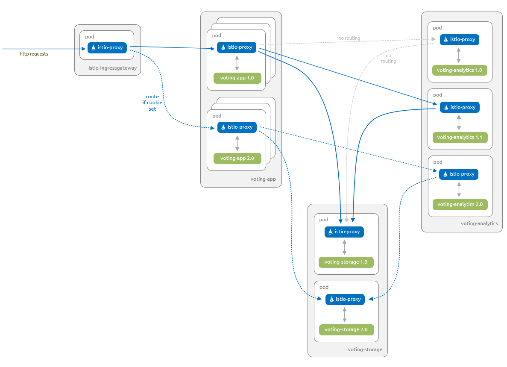
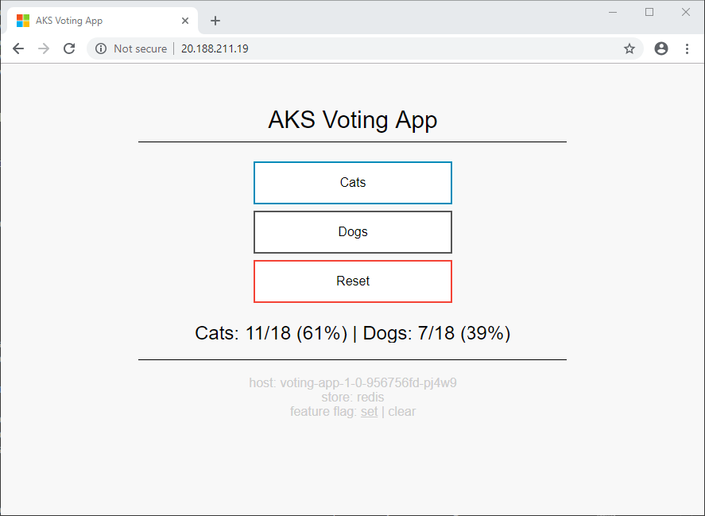
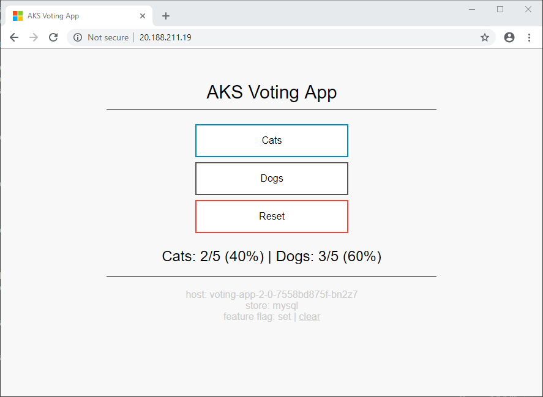
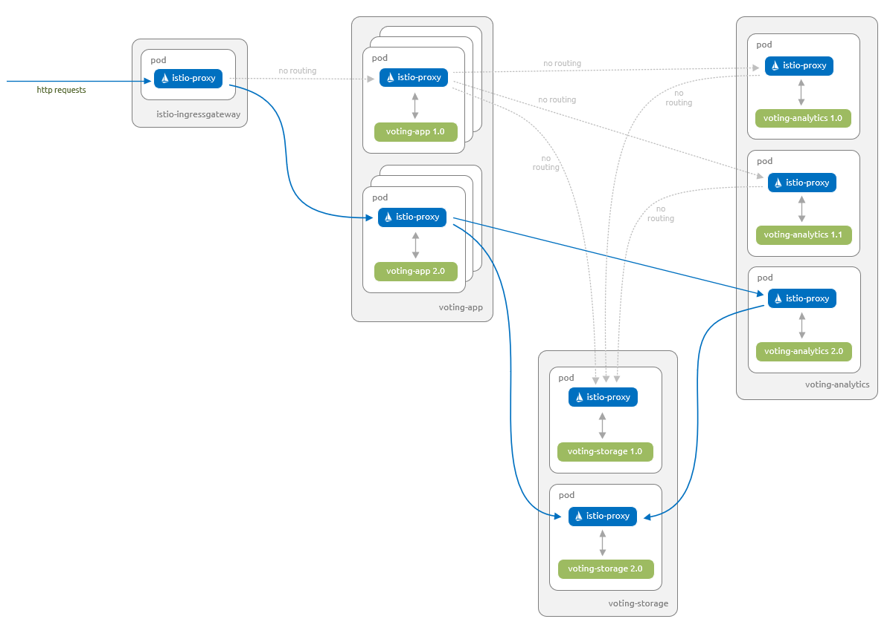

# Prerequisites

- Use the Bash environment in Azure Cloud Shell.

[](https://shell.azure.com/)

# Create AKS cluster

Use the [az aks create](https://docs.microsoft.com/en-us/cli/azure/aks?view=azure-cli-latest&preserve-view=true#az-aks-create) command to create an AKS cluster. The following example creates a cluster named myAKSCluster with one node. This will take several minutes to complete.

### Azure CLI

```
az aks create --resource-group myResourceGroup --name myAKSCluster --node-count 2 --enable-addons monitoring --generate-ssh-keys
```

After a few minutes, the command completes and returns JSON-formatted information about the cluster.

> Note
>
> When creating an AKS cluster a second resource group is automatically created to store the AKS resources. For more information see Why are two resource groups created with AKS?

o configure kubectl to connect to your Kubernetes cluster, use the az aks get-credentials command. This command downloads credentials and configures the Kubernetes CLI to use them.

#### Azure CLI

```
az aks get-credentials --resource-group myResourceGroup --name myAKSCluster
```

Note

The above command uses the default location for the Kubernetes configuration file, which is ~/.kube/config. You can specify a different location for your Kubernetes configuration file using --file.

To verify the connection to your cluster, use the kubectl get command to return a list of the cluster nodes.

#### Azure CLI

```
kubectl get nodes
```

The following example output shows the single node created in the previous steps. Make sure that the status of the node is Ready:

#### Output

```

NAME                                STATUS   ROLES   AGE     VERSION
aks-nodepool1-41745961-vmss000000   Ready    agent   4m51s   v1.18.14
aks-nodepool1-41745961-vmss000001   Ready    agent   4m55s   v1.18.14

```

# Install the Istio Operator on AKS

Istio provides an Operator to manage installation and updates to the Istio components within your AKS cluster. We'll install the Istio Operator using the istioctl client binary.

#### Bash

```

istioctl operator init

```

You should see something like the following output to confirm that the Istio Operator has been installed.

```Console
Using operator Deployment image: docker.io/istio/operator:1.7.4
✔ Istio operator installed
✔ Installation complete
```

The Istio Operator is installed into the istio-operator namespace. Query the namespace.

#### Bash

```
kubectl get all -n istio-operator
```

You should see the following components deployed.

```Console
NAME                                  READY   STATUS    RESTARTS   AGE
pod/istio-operator-6d7958b7bf-wxgdc   1/1     Running   0          2m43s

NAME                     TYPE        CLUSTER-IP   EXTERNAL-IP   PORT(S)    AGE
service/istio-operator   ClusterIP   10.0.8.57    <none>        8383/TCP   2m43s

NAME                             READY   UP-TO-DATE   AVAILABLE   AGE
deployment.apps/istio-operator   1/1     1            1           2m43s

NAME                                        DESIRED   CURRENT   READY   AGE
replicaset.apps/istio-operator-6d7958b7bf   1         1         1       2m43s
```

You can learn more about the Operator pattern and how it can help automate complex tasks via kubernetes.io.

# Install Istio components

Now that we've successfully installed the Istio Operator in our AKS cluster, it's time to install the Istio components.

We will leverage the default Istio Configuration Profile to build the Istio Operator Spec.

You can run the following istioctl command to view the configuration for the default Istio Configuration Profile.

#### Bash

```
istioctl profile dump default
```

> Note
> Istio currently must be scheduled to run on Linux nodes. If you have Windows Server nodes in your cluster, you must ensure that the Istio pods are only scheduled to run on Linux nodes. We'll use node selectors to make sure pods are scheduled to the correct nodes.

> Caution

> The Istio CNI Istio features are currently in Alpha, so thought should be given before enabling these.

Create a file called istio.aks.yaml with the following content. This file will hold the Istio Operator Spec for configuring Istio.

#### Bash

```
code istio.aks.yaml
```

#### YAML

```
apiVersion: install.istio.io/v1alpha1
kind: IstioOperator
metadata:
  namespace: istio-system
  name: istio-control-plane
spec:
  # Use the default profile as the base
  # More details at: https://istio.io/docs/setup/additional-setup/config-profiles/
  profile: default
  # Enable the addons that we will want to use
  addonComponents:
    grafana:
      enabled: true
    prometheus:
      enabled: true
    tracing:
      enabled: true
    kiali:
      enabled: true
  values:
    global:
      # Ensure that the Istio pods are only scheduled to run on Linux nodes
      defaultNodeSelector:
        beta.kubernetes.io/os: linux
    kiali:
      dashboard:
        auth:
          strategy: anonymous
```

Create the `istio-system` namespace and deploy the Istio Operator Spec to that namespace. The Istio Operator will be watching for the Istio Operator Spec and will use it to install and configure Istio in your AKS cluster.

#### Bash

```
kubectl create ns istio-system
```

#### Bash

```
kubectl apply -f istio.aks.yaml
```

At this point, you've deployed Istio to your AKS cluster. To ensure that we have a successful deployment of Istio, let's move on to the next section to [Validate the Istio installation](https://docs.microsoft.com/en-us/azure/aks/servicemesh-istio-install?pivots=client-operating-system-linux#validate-the-istio-installation).

Validate the Istio installation
Query the istio-system namespace, where the Istio and add-on components were installed by the Istio Operator:

#### Bash

```
kubectl get all -n istio-system
```

You should see the following components:

- istio\* - the Istio components
- jaeger-\*, tracing, and zipkin - tracing addon
- prometheus - metrics addon
- grafana - analytics and monitoring dashboard addon
  kiali - service mesh dashboard addon

```Console
NAME READY STATUS RESTARTS AGE
pod/grafana-7cf9794c74-mpfbp 1/1 Running 0 5m53s
pod/istio-ingressgateway-86b5dbdcb9-ndrp5 1/1 Running 0 5m57s
pod/istio-tracing-c98f4b8fc-zqklg 1/1 Running 0 82s
pod/istiod-6965c56995-4ph9h 1/1 Running 0 6m15s
pod/kiali-7b44985d68-p87zh 1/1 Running 0 81s
pod/prometheus-6868989549-5ghzz 1/1 Running 0 81s

NAME TYPE CLUSTER-IP EXTERNAL-IP PORT(S) AGE
service/grafana ClusterIP 10.0.226.39 <none> 3000/TCP 5m54s
service/istio-ingressgateway LoadBalancer 10.0.143.56 20.53.72.254 15021:32166/TCP,80:31684/TCP,443:31302/TCP,15443:30863/TCP 5m57s
service/istiod ClusterIP 10.0.211.228 <none> 15010/TCP,15012/TCP,443/TCP,15014/TCP,853/TCP 6m16s
service/jaeger-agent ClusterIP None <none> 5775/UDP,6831/UDP,6832/UDP 82s
service/jaeger-collector ClusterIP 10.0.7.62 <none> 14267/TCP,14268/TCP,14250/TCP 82s
service/jaeger-collector-headless ClusterIP None <none> 14250/TCP 82s
service/jaeger-query ClusterIP 10.0.52.172 <none> 16686/TCP 82s
service/kiali ClusterIP 10.0.71.179 <none> 20001/TCP 82s
service/prometheus ClusterIP 10.0.171.151 <none> 9090/TCP 82s
service/tracing ClusterIP 10.0.195.137 <none> 80/TCP 82s
service/zipkin ClusterIP 10.0.136.111 <none> 9411/TCP 82s

NAME READY UP-TO-DATE AVAILABLE AGE
deployment.apps/grafana 1/1 1 1 5m54s
deployment.apps/istio-ingressgateway 1/1 1 1 5m58s
deployment.apps/istio-tracing 1/1 1 1 83s
deployment.apps/istiod 1/1 1 1 6m16s
deployment.apps/kiali 1/1 1 1 83s
deployment.apps/prometheus 1/1 1 1 82s

NAME DESIRED CURRENT READY AGE
replicaset.apps/grafana-7cf9794c74 1 1 1 5m54s
replicaset.apps/istio-ingressgateway-86b5dbdcb9 1 1 1 5m58s
replicaset.apps/istio-tracing-c98f4b8fc 1 1 1 83s
replicaset.apps/istiod-6965c56995 1 1 1 6m16s
replicaset.apps/kiali-7b44985d68 1 1 1 82s
replicaset.apps/prometheus-6868989549 1 1 1 82s

NAME REFERENCE TARGETS MINPODS MAXPODS REPLICAS AGE
horizontalpodautoscaler.autoscaling/istio-ingressgateway Deployment/istio-ingressgateway 7%/80% 1 5 1 5m57s
horizontalpodautoscaler.autoscaling/istiod Deployment/istiod 1%/80% 1 5 1 6m16s
```

You can also gain additional insight into the installation by watching the logs for the Istio Operator.

#### Bash

```
kubectl logs -n istio-operator -l name=istio-operator -f
```

If the `istio-ingressgateway` shows an external ip of <pending>, wait a few minutes until an IP address has been assigned by Azure networking.

All of the pods should show a status of Running. If your pods don't have these statuses, wait a minute or two until they do. If any pods report an issue, use the kubectl describe pod command to review their output and status.

# Accessing the add-ons

A number of add-ons were installed by the Istio Operator that provide additional functionality. The web applications for the add-ons are not exposed publicly via an external ip address.

To access the add-on user interfaces, use the istioctl dashboard command. This command uses [kubectl port-forward](https://kubernetes.io/docs/reference/generated/kubectl/kubectl-commands#port-forward) and a random port to create a secure connection between your client machine and the relevant pod in your AKS cluster. It will then automatically open the add-on web application in your default browser.

## Grafana

The analytics and monitoring dashboards for Istio are provided by Grafana. Remember to use the credentials you created via the Grafana secret earlier when prompted. Open the Grafana dashboard securely as follows:

```Console
istioctl dashboard grafana
```

## Prometheus

Metrics for Istio are provided by Prometheus. Open the Prometheus dashboard securely as follows:

```Console
istioctl dashboard prometheus
```

## Jaeger

Tracing within Istio is provided by Jaeger. Open the Jaeger dashboard securely as follows:

```Console
istioctl dashboard jaeger
```

## Kiali

A service mesh observability dashboard is provided by Kiali. Remember to use the credentials you created via the Kiali secret earlier when prompted. Open the Kiali dashboard securely as follows:

```Console
istioctl dashboard kiali
```

## Envoy

A simple interface to the Envoy proxies is available. It provides configuration information and metrics for an Envoy proxy running in a specified pod. Open the Envoy interface securely as follows:

```Console
istioctl dashboard envoy
<pod-name>.<namespace>
```

## Next steps

# About this application scenario

The sample AKS voting app provides two voting options (Cats or Dogs) to users. There is a storage component that persists the number of votes for each option. Additionally, there is an analytics component that provides details around the votes cast for each option.

In this application scenario, you start by deploying version 1.0 of the voting app and version 1.0 of the analytics component. The analytics component provides simple counts for the number of votes. The voting app and analytics component interact with version 1.0 of the storage component, which is backed by Redis.

You upgrade the analytics component to version 1.1, which provides counts, and now totals and percentages.

A subset of users test version 2.0 of the app via a canary release. This new version uses a storage component that is backed by a MySQL database.

Once you're confident that version 2.0 works as expected on your subset of users, you roll out version 2.0 to all your users.

# Deploy the application

Let's start by deploying the application into your Azure Kubernetes Service (AKS) cluster. The following diagram shows what runs by the end of this section - version 1.0 of all components with inbound requests serviced via the Istio ingress gateway:



The artifacts you need to follow along with this article are available in the Azure-Samples/aks-voting-app GitHub repo. You can either download the artifacts or clone the repo as follows:

```Console

git clone https://github.com/Onemanwolf/Gap_Labs.git

```

Change to the following folder in the downloaded / cloned repo and run all subsequent steps from this folder:

```Console
cd Gap_Labs/code/intelligent-routing-with-istio/
```

First, create a namespace in your AKS cluster for the sample AKS voting app named voting as follows:

```Console
kubectl create namespace voting
```

Label the namespace with istio-injection=enabled. This label instructs Istio to automatically inject the istio-proxies as sidecars into all of your pods in this namespace.

```Console
kubectl label namespace voting istio-injection=enabled
```

Now let's create the components for the AKS Voting app. Create these components in the voting namespace created in a previous step.

#### YAML

```
# voting-storage-deployment-1.0.yaml
apiVersion: apps/v1
kind: Deployment
metadata:
  name: voting-storage-1-0
spec:
  replicas: 1
  selector:
    matchLabels:
      app: voting-storage
      version: "1.0"
  template:
    metadata:
      labels:
        app: voting-storage
        version: "1.0"
    spec:
      containers:
      - name: voting-storage
        image: redis:4.0.10
        ports:
        - containerPort: 6379
          name: redis
---
# voting-storage-service.yaml
apiVersion: v1
kind: Service
metadata:
  name: voting-storage
  labels:
    app: voting-storage
spec:
  ports:
  - port: 6379
    name: redis
  selector:
    app: voting-storage
---
# voting-analytics-deployment-1.0.yaml
apiVersion: apps/v1
kind: Deployment
metadata:
  name: voting-analytics-1-0
spec:
  replicas: 1
  selector:
    matchLabels:
      app: voting-analytics
      version: "1.0"
  template:
    metadata:
      labels:
        app: voting-analytics
        version: "1.0"
    spec:
      containers:
      - name: voting-analytics
        image: mcr.microsoft.com/aks/samples/voting/analytics:1.0
        imagePullPolicy: Always
        ports:
        - containerPort: 8080
          name: http
        env:
        - name: REDIS_HOST
          value: "voting-storage"
---
# voting-analytics-service.yaml
apiVersion: v1
kind: Service
metadata:
  name: voting-analytics
  labels:
    app: voting-analytics
spec:
  ports:
  - port: 8080
    name: http
  selector:
    app: voting-analytics
---
# voting-app-deployment-1.0.yaml
apiVersion: apps/v1
kind: Deployment
metadata:
  name: voting-app-1-0
spec:
  replicas: 3
  selector:
    matchLabels:
      app: voting-app
      version: "1.0"
  template:
    metadata:
      labels:
        app: voting-app
        version: "1.0"
    spec:
      containers:
      - name: voting-app
        image: mcr.microsoft.com/aks/samples/voting/app:1.0
        imagePullPolicy: Always
        ports:
        - containerPort: 8080
          name: http
        env:
        - name: SHOWDETAILS
          value: "true"
        - name: FEATUREFLAG
          value: "true"
        - name: REDIS_HOST
          value: "voting-storage"
        - name: ANALYTICS_HOST
          value: "voting-analytics"
---
# voting-app-service.yaml
apiVersion: v1
kind: Service
metadata:
  name: voting-app
  labels:
    app: voting-app
spec:
  ports:
  - port: 8080
    name: http
  selector:
    app: voting-app
```

```Console
kubectl apply -f kubernetes/step-1-create-voting-app.yaml --namespace voting
```

The following example output shows the resources being created:

```Output
deployment.apps/voting-storage-1-0 created
service/voting-storage created
deployment.apps/voting-analytics-1-0 created
service/voting-analytics created
deployment.apps/voting-app-1-0 created
service/voting-app created
```

> Note

> Istio has some specific requirements around pods and services. For more information, see the Istio [Requirements for Pods and Services documentation](https://istio.io/docs/setup/kubernetes/prepare/requirements/).

To see the pods that have been created, use the kubectl get pods command as follows:

```Console
kubectl get pods -n voting --show-labels
```

The following example output shows there are three instances of the `voting-app` pod and a single instance of both the `voting-analytics` and voting-storage pods. Each of the pods has two containers. One of these containers is the component, and the other is the `istio-proxy`:

```Output
NAME                                    READY     STATUS    RESTARTS   AGE   LABELS
voting-analytics-1-0-57c7fccb44-ng7dl   2/2       Running   0          39s   app=voting-analytics,pod-template-hash=57c7fccb44,version=1.0
voting-app-1-0-956756fd-d5w7z           2/2       Running   0          39s   app=voting-app,pod-template-hash=956756fd,version=1.0
voting-app-1-0-956756fd-f6h69           2/2       Running   0          39s   app=voting-app,pod-template-hash=956756fd,version=1.0
voting-app-1-0-956756fd-wsxvt           2/2       Running   0          39s   app=voting-app,pod-template-hash=956756fd,version=1.0
voting-storage-1-0-5d8fcc89c4-2jhms     2/2       Running   0          39s   app=voting-storage,pod-template-hash=5d8fcc89c4,version=1.0
```

To see information about the pod, we'll use the [kubectl describe pod](https://kubernetes.io/docs/reference/generated/kubectl/kubectl-commands#describe) command with label selectors to select the voting-analytics pod. We'll filter the output to show the details of the two containers present in the pod:

#### Bash:

```Bash
kubectl describe pod -l "app=voting-analytics, version=1.0" -n voting | egrep "istio-proxy:|voting-analytics:" -A2
```

The `istio-proxy` container has automatically been injected by Istio to manage the network traffic to and from your components, as shown in the following example output:

#### Output:

```Console
  voting-analytics:
    Container ID:   docker://35efa1f31d95ca737ff2e2229ab8fe7d9f2f8a39ac11366008f31287be4cea4d
    Image:          mcr.microsoft.com/aks/samples/voting/analytics:1.0
--
  istio-proxy:
    Container ID:  docker://1fa4eb43e8d4f375058c23cc062084f91c0863015e58eb377276b20c809d43c6
    Image:         docker.io/istio/proxyv2:1.3.2
```

You can't connect to the voting app until you create the Istio [Gateway](https://istio.io/docs/reference/config/networking/v1alpha3/gateway/) and [Virtual Service](https://istio.io/docs/reference/config/networking/v1alpha3/virtual-service/). These Istio resources route traffic from the default Istio ingress gateway to our application.

> Note
> A Gateway is a component at the edge of the service mesh that receives inbound or outbound HTTP and TCP traffic.
>
> A Virtual Service defines a set of routing rules for one or more destination services.

Use the `kubectl apply` command to deploy the Gateway and Virtual Service yaml. Remember to specify the namespace that these resources are deployed into.

```
# voting-app-virtualservice.yaml
apiVersion: networking.istio.io/v1alpha3
kind: VirtualService
metadata:
  name: voting-app
spec:
  hosts:
  - "*"
  gateways:
  - voting-app-gateway
  http:
  - match:
    - uri:
        prefix: /
    route:
    - destination:
        host: voting-app.voting.svc.cluster.local
        port:
          number: 8080
---
# voting-app-gateway.yaml
apiVersion: networking.istio.io/v1alpha3
kind: Gateway
metadata:
  name: voting-app-gateway
spec:
  selector:
    istio: ingressgateway
  servers:
  - port:
      number: 80
      name: http
      protocol: HTTP
    hosts:
    - "*"
```

```Console
kubectl apply -f istio/step-1-create-voting-app-gateway.yaml --namespace voting
```

The following example output shows the new Gateway and Virtual Service being created:

#### Output

```Output
virtualservice.networking.istio.io/voting-app created
gateway.networking.istio.io/voting-app-gateway created
```

Obtain the IP address of the Istio Ingress Gateway using the following command:

```Output
kubectl get service istio-ingressgateway --namespace istio-system -o jsonpath='{.status.loadBalancer.ingress[0].ip}'
```

The following example output shows the IP address of the Ingress Gateway:

```Output
20.188.211.19
```

Open up a browser and paste in the IP address. The sample AKS voting app is displayed.



The information at the bottom of the screen shows that the app uses version 1.0 of voting-app and version 1.0 of `voting-storage` (Redis).

## Update the application

Let's deploy a new version of the analytics component. This new version 1.1 displays totals and percentages in addition to the count for each category.

The following diagram shows what will be running at the end of this section - only version 1.1 of our voting-analytics component has traffic routed from the voting-app component. Even though version 1.0 of our voting-analytics component continues to run and is referenced by the voting-analytics service, the Istio proxies disallow traffic to and from it.


Let's deploy version 1.1 of the voting-analytics component. Create this component in the voting namespace:

```
# voting-analytics-deployment-1.1.yaml
apiVersion: apps/v1
kind: Deployment
metadata:
  name: voting-analytics-1-1
spec:
  replicas: 1
  selector:
    matchLabels:
      app: voting-analytics
      version: "1.1"
  template:
    metadata:
      labels:
        app: voting-analytics
        version: "1.1"
    spec:
      containers:
      - name: voting-analytics
        image: mcr.microsoft.com/aks/samples/voting/analytics:1.1
        imagePullPolicy: Always
        ports:
        - containerPort: 8080
          name: http
        env:
        - name: REDIS_HOST
          value: "voting-storage"


```

#### Bash

```Console
kubectl apply -f kubernetes/step-2-update-voting-analytics-to-1.1.yaml --namespace voting
```

The following example output shows the resources being created:

#### Output

```Output
deployment.apps/voting-analytics-1-1 created
```

Open the sample AKS voting app in a browser again, using the IP address of the Istio Ingress Gateway obtained in the previous step.

Your browser alternates between the two views shown below. Since you are using a Kubernetes Service for the voting-analytics component with only a single label selector (app: voting-analytics), Kubernetes uses the default behavior of round-robin between the pods that match that selector. In this case, it is both version 1.0 and 1.1 of your voting-analytics pods.



You can visualize the switching between the two versions of the voting-analytics component as follows. Remember to use the IP address of your own Istio Ingress Gateway.

#### Bash

```
INGRESS_IP=20.188.211.19
for i in {1..5}; do curl -si $INGRESS_IP | grep results; done
```

The following example output shows the relevant part of the returned web site as the site switches between versions:

#### Output

```
  <div id="results"> Cats: 2 | Dogs: 4 </div>
  <div id="results"> Cats: 2 | Dogs: 4 </div>
  <div id="results"> Cats: 2/6 (33%) | Dogs: 4/6 (67%) </div>
  <div id="results"> Cats: 2 | Dogs: 4 </div>
  <div id="results"> Cats: 2/6 (33%) | Dogs: 4/6 (67%) </div>
```

# Lock down traffic to version 1.1 of the application

Now let's lock down traffic to only version 1.1 of the `voting-analytics` component and to version `1.0` of the `voting-storage` component. You then define routing rules for all of the other components.

- A Virtual Service defines a set of routing rules for one or more destination services.
- A Destination Rule defines traffic policies and version specific policies.
- A Policy defines what authentication methods can be accepted on workload(s).

Use the `kubectl apply` command to replace the Virtual Service definition on your voting-app and add Destination Rules and Virtual Services for the other components. You will add a Policy to the voting namespace to ensure that all communicate between services is secured using mutual TLS and client certificates.

- The Policy has `peers.mtls.mode` set to `STRICT` to ensure that mutual TLS is enforced between your services within the `voting` namespace.

- We also set the trafficPolicy.tls.mode to ISTIO_MUTUAL in all our Destination Rules. Istio provides services with strong identities and secures communications between services using mutual TLS and client certificates that Istio transparently manages.

```
# voting-app-virtualservice-1.0.yaml
apiVersion: networking.istio.io/v1alpha3
kind: VirtualService
metadata:
  name: voting-app
spec:
  hosts:
  - "*"
  gateways:
  - voting-app-gateway
  http:
  - match:
    - uri:
        prefix: /
    route:
    - destination:
        host: voting-app.voting.svc.cluster.local
        subset: v1-0
        port:
          number: 8080
---
apiVersion: "security.istio.io/v1beta1"
kind: "PeerAuthentication"
metadata:
  name: "default"
spec:
  mtls:
    mode: STRICT
---
# voting-app-destinationrule-1.0.yaml
apiVersion: networking.istio.io/v1alpha3
kind: DestinationRule
metadata:
  name: voting-app
spec:
  host: voting-app.voting.svc.cluster.local
  trafficPolicy:
    tls:
      mode: ISTIO_MUTUAL
  subsets:
  - name: v1-0
    labels:
      app: voting-app
      version: "1.0"
---
# voting-analytics-destinationrule-1.0-and-1.1.yaml
apiVersion: networking.istio.io/v1alpha3
kind: DestinationRule
metadata:
  name: voting-analytics
spec:
  host: voting-analytics.voting.svc.cluster.local
  trafficPolicy:
    tls:
      mode: ISTIO_MUTUAL
  subsets:
  - name: v1-0
    labels:
      app: voting-analytics
      version: "1.0"
  - name: v1-1
    labels:
      app: voting-analytics
      version: "1.1"
---
# voting-analytics-virtualservice-1.1.yaml
apiVersion: networking.istio.io/v1alpha3
kind: VirtualService
metadata:
  name: voting-analytics
spec:
  hosts:
  - voting-analytics.voting.svc.cluster.local
  http:
  - match:
    - sourceLabels:
        app: voting-app
        version: "1.0"
    route:
    - destination:
        host: voting-analytics.voting.svc.cluster.local
        subset: v1-1
        port:
          number: 8080
---
# voting-storage-destinationrule-1.0.yaml
apiVersion: networking.istio.io/v1alpha3
kind: DestinationRule
metadata:
  name: voting-storage
spec:
  host: voting-storage.voting.svc.cluster.local
  trafficPolicy:
    tls:
      mode: ISTIO_MUTUAL
  subsets:
  - name: v1-0
    labels:
      app: voting-storage
      version: "1.0"
---
# voting-storage-virtualservice-1.0.yaml
apiVersion: networking.istio.io/v1alpha3
kind: VirtualService
metadata:
  name: voting-storage
spec:
  hosts:
  - voting-storage.voting.svc.cluster.local
  tcp:
  - match:
    - sourceLabels:
        app: voting-app
        version: "1.0"
    route:
    - destination:
        host: voting-storage.voting.svc.cluster.local
        subset: v1-0
        port:
          number: 6379
  - match:
    - sourceLabels:
        app: voting-analytics
        version: "1.1"
    route:
    - destination:
        host: voting-storage.voting.svc.cluster.local
        subset: v1-0
        port:
          number: 6379

```

```Console
kubectl apply -f istio/step-2-update-and-add-routing-for-all-components.yaml --namespace voting
```

The following example output shows the new Policy, Destination Rules, and Virtual Services being updated/created:

#### Output

```
virtualservice.networking.istio.io/voting-app configured
policy.authentication.istio.io/default created
destinationrule.networking.istio.io/voting-app created
destinationrule.networking.istio.io/voting-analytics created
virtualservice.networking.istio.io/voting-analytics created
destinationrule.networking.istio.io/voting-storage created
virtualservice.networking.istio.io/voting-storage created
```

If you open the AKS Voting app in a browser again, only the new version 1.1 of the voting-analytics component is used by the voting-app component.


You can visualize that you are now only routed to version 1.1 of your voting-analytics component as follows. Remember to use the IP address of your own Istio Ingress Gateway:

#### Bash

```
INGRESS_IP=20.188.211.19
for i in {1..5}; do curl -si $INGRESS_IP | grep results; done
```

The following example output shows the relevant part of the returned web site:

#### Output

```
<div id="results"> Cats: 2/6 (33%) | Dogs: 4/6 (67%) </div>
  <div id="results"> Cats: 2/6 (33%) | Dogs: 4/6 (67%) </div>
  <div id="results"> Cats: 2/6 (33%) | Dogs: 4/6 (67%) </div>
  <div id="results"> Cats: 2/6 (33%) | Dogs: 4/6 (67%) </div>
  <div id="results"> Cats: 2/6 (33%) | Dogs: 4/6 (67%) </div>
```

# Roll out a canary release of the application

Now let's deploy a new version 2.0 of the `voting-app`, `voting-analytics`, and `voting-storage` components. The new voting-storage component use MySQL instead of Redis, and the voting-app and voting-analytics components are updated to allow them to use this new voting-storage component.

The `voting-app` component now supports feature flag functionality. This feature flag allows you to test the canary release capability of Istio for a subset of users.

The following diagram shows what you will have running at the end of this section.

- Version 1.0 of the voting-app component, version 1.1 of the voting-analytics component and version 1.0 of the voting-storage component are able to communicate with each other.
- Version 2.0 of the voting-app component, version 2.0 of the voting-analytics component and version 2.0 of the voting-storage component are able to communicate with each other.
- Version 2.0 of the voting-app component are only accessible to users that have a specific feature flag set. This change is managed using a feature flag via a cookie.



First, update the Istio Destination Rules and Virtual Services to cater for these new components. These updates ensure that you don't route traffic incorrectly to the new components and users don't get unexpected access:

```
# voting-app-destinationrule-1.0-and-2.0.yaml
apiVersion: networking.istio.io/v1alpha3
kind: DestinationRule
metadata:
  name: voting-app
spec:
  host: voting-app.voting.svc.cluster.local
  trafficPolicy:
    tls:
      mode: ISTIO_MUTUAL
  subsets:
  - name: v1-0
    labels:
      app: voting-app
      version: "1.0"
  - name: v2-0
    labels:
      app: voting-app
      version: "2.0"
---
# voting-app-virtualservice-1.0-and-2.0.yaml
apiVersion: networking.istio.io/v1alpha3
kind: VirtualService
metadata:
  name: voting-app
spec:
  hosts:
  - "*"
  gateways:
  - voting-app-gateway
  http:
  - match:
    - uri:
        prefix: /
      headers:
        cookie:
          regex: "^(.*?; ?)?(featureflag=on)(;.*)?$"
    route:
    - destination:
        host: voting-app.voting.svc.cluster.local
        subset: v2-0
        port:
          number: 8080
  - match:
    - uri:
        prefix: /
    route:
    - destination:
        host: voting-app.voting.svc.cluster.local
        subset: v1-0
        port:
          number: 8080
---
# voting-analytics-destinationrule-1.1-and-2.0.yaml
apiVersion: networking.istio.io/v1alpha3
kind: DestinationRule
metadata:
  name: voting-analytics
spec:
  host: voting-analytics.voting.svc.cluster.local
  trafficPolicy:
    tls:
      mode: ISTIO_MUTUAL
  subsets:
  - name: v1-1
    labels:
      app: voting-analytics
      version: "1.1"
  - name: v2-0
    labels:
      app: voting-analytics
      version: "2.0"
---
# voting-analytics-virtualservice-1.1-and-2.0.yaml
apiVersion: networking.istio.io/v1alpha3
kind: VirtualService
metadata:
  name: voting-analytics
spec:
  hosts:
  - voting-analytics.voting.svc.cluster.local
  http:
  - match:
    - sourceLabels:
        app: voting-app
        version: "1.0"
    route:
    - destination:
        host: voting-analytics.voting.svc.cluster.local
        subset: v1-1
        port:
          number: 8080
  - match:
    - sourceLabels:
        app: voting-app
        version: "2.0"
    route:
    - destination:
        host: voting-analytics.voting.svc.cluster.local
        subset: v2-0
        port:
          number: 8080
---
# voting-storage-destinationrule-1.0-and-2.0.yaml
apiVersion: networking.istio.io/v1alpha3
kind: DestinationRule
metadata:
  name: voting-storage
spec:
  host: voting-storage.voting.svc.cluster.local
  trafficPolicy:
    tls:
      mode: ISTIO_MUTUAL
  subsets:
  - name: v1-0
    labels:
      app: voting-storage
      version: "1.0"
  - name: v2-0
    labels:
      app: voting-storage
      version: "2.0"
---
# voting-storage-virtualservice-1.0-and-2.0.yaml
apiVersion: networking.istio.io/v1alpha3
kind: VirtualService
metadata:
  name: voting-storage
spec:
  hosts:
  - voting-storage.voting.svc.cluster.local
  tcp:
  - match:
    - sourceLabels:
        app: voting-app
        version: "1.0"
    route:
    - destination:
        host: voting-storage.voting.svc.cluster.local
        subset: v1-0
        port:
          number: 6379
  - match:
    - sourceLabels:
        app: voting-analytics
        version: "1.1"
    route:
    - destination:
        host: voting-storage.voting.svc.cluster.local
        subset: v1-0
        port:
          number: 6379
  - match:
    - sourceLabels:
        app: voting-app
        version: "2.0"
    route:
    - destination:
        host: voting-storage.voting.svc.cluster.local
        subset: v2-0
        port:
          number: 3306
  - match:
    - sourceLabels:
        app: voting-analytics
        version: "2.0"
    route:
    - destination:
        host: voting-storage.voting.svc.cluster.local
        subset: v2-0
        port:
          number: 3306

```

```Console
kubectl apply -f istio/step-3-add-routing-for-2.0-components.yaml --namespace voting
```

The following example output shows the Destination Rules and Virtual Services being updated:

#### Output

```
destinationrule.networking.istio.io/voting-app configured
virtualservice.networking.istio.io/voting-app configured
destinationrule.networking.istio.io/voting-analytics configured
virtualservice.networking.istio.io/voting-analytics configured
destinationrule.networking.istio.io/voting-storage configured
virtualservice.networking.istio.io/voting-storage configured
```

Next, let's add the Kubernetes objects for the new version 2.0 components. You also update the voting-storage service to include the 3306 port for MySQL:

```
# voting-storage-service-add-mysql.yaml
apiVersion: v1
kind: Service
metadata:
  name: voting-storage
  labels:
    app: voting-storage
spec:
  ports:
  - port: 6379
    name: redis
  - port: 3306
    name: mysql
  selector:
    app: voting-storage
---
# voting-storage-secret.yaml
apiVersion: v1
kind: Secret
metadata:
  name: voting-storage-secret
type: Opaque
data:
  MYSQL_USER: ZGJ1c2Vy
  MYSQL_PASSWORD: UGFzc3dvcmQxMg==
  MYSQL_DATABASE: YXp1cmV2b3Rl
  MYSQL_ROOT_PASSWORD: UGFzc3dvcmQxMg==
---
# voting-storage-deployment-2.0.yaml
apiVersion: apps/v1
kind: Deployment
metadata:
  name: voting-storage-2-0
spec:
  replicas: 1
  selector:
    matchLabels:
      app: voting-storage
      version: "2.0"
  template:
    metadata:
      labels:
        app: voting-storage
        version: "2.0"
    spec:
      containers:
      - name: voting-storage
        image: mcr.microsoft.com/aks/samples/voting/storage:2.0
        args: ["--ignore-db-dir=lost+found"]
        ports:
        - containerPort: 3306
          name: mysql
        volumeMounts:
        - name: mysql-persistent-storage
          mountPath: /var/lib/mysql
        env:
        - name: MYSQL_ROOT_PASSWORD
          valueFrom:
            secretKeyRef:
              name: voting-storage-secret
              key: MYSQL_ROOT_PASSWORD
        - name: MYSQL_USER
          valueFrom:
            secretKeyRef:
              name: voting-storage-secret
              key: MYSQL_USER
        - name: MYSQL_PASSWORD
          valueFrom:
            secretKeyRef:
              name: voting-storage-secret
              key: MYSQL_PASSWORD
        - name: MYSQL_DATABASE
          valueFrom:
            secretKeyRef:
              name: voting-storage-secret
              key: MYSQL_DATABASE
      volumes:
      - name: mysql-persistent-storage
        persistentVolumeClaim:
          claimName: mysql-pv-claim
---
apiVersion: v1
kind: PersistentVolumeClaim
metadata:
  name: mysql-pv-claim
spec:
  accessModes:
  - ReadWriteOnce
  resources:
    requests:
      storage: 1Gi
---
# voting-analytics-deployment-2.0.yaml
apiVersion: apps/v1
kind: Deployment
metadata:
  name: voting-analytics-2-0
spec:
  replicas: 1
  selector:
    matchLabels:
      app: voting-analytics
      version: "2.0"
  template:
    metadata:
      labels:
        app: voting-analytics
        version: "2.0"
    spec:
      containers:
      - name: voting-analytics
        image: mcr.microsoft.com/aks/samples/voting/analytics:2.0
        imagePullPolicy: Always
        ports:
        - containerPort: 8080
          name: http
        env:
        - name: MYSQL_HOST
          value: "voting-storage"
        - name: MYSQL_USER
          valueFrom:
            secretKeyRef:
              name: voting-storage-secret
              key: MYSQL_USER
        - name: MYSQL_PASSWORD
          valueFrom:
            secretKeyRef:
              name: voting-storage-secret
              key: MYSQL_PASSWORD
        - name: MYSQL_DATABASE
          valueFrom:
            secretKeyRef:
              name: voting-storage-secret
              key: MYSQL_DATABASE
---
# voting-app-deployment-2.0.yaml
apiVersion: apps/v1
kind: Deployment
metadata:
  name: voting-app-2-0
spec:
  replicas: 3
  selector:
    matchLabels:
      app: voting-app
      version: "2.0"
  template:
    metadata:
      labels:
        app: voting-app
        version: "2.0"
    spec:
      containers:
      - name: voting-app
        image: mcr.microsoft.com/aks/samples/voting/app:2.0
        imagePullPolicy: Always
        ports:
        - containerPort: 8080
          name: http
        env:
        - name: SHOWDETAILS
          value: "true"
        - name: FEATUREFLAG
          value: "true"
        - name: MYSQL_HOST
          value: "voting-storage"
        - name: MYSQL_USER
          valueFrom:
            secretKeyRef:
              name: voting-storage-secret
              key: MYSQL_USER
        - name: MYSQL_PASSWORD
          valueFrom:
            secretKeyRef:
              name: voting-storage-secret
              key: MYSQL_PASSWORD
        - name: MYSQL_DATABASE
          valueFrom:
            secretKeyRef:
              name: voting-storage-secret
              key: MYSQL_DATABASE
        - name: ANALYTICS_HOST
          value: "voting-analytics"

```

```Console
kubectl apply -f kubernetes/step-3-update-voting-app-with-new-storage.yaml --namespace voting
```

The following example output shows the Kubernetes objects are successfully updated or created:

#### Output

```
service/voting-storage configured
secret/voting-storage-secret created
deployment.apps/voting-storage-2-0 created
persistentvolumeclaim/mysql-pv-claim created
deployment.apps/voting-analytics-2-0 created
deployment.apps/voting-app-2-0 created
```

Wait until all the version 2.0 pods are running. Use the kubectl get pods command with the -w watch switch to watch for changes on all pods in the voting namespace:

```Console
kubectl get pods --namespace voting -w
```

You should now be able to switch between the version 1.0 and version 2.0 (canary) of the voting application. The feature flag toggle at the bottom of the screen sets a cookie. This cookie is used by the voting-app Virtual Service to route users to the new version 2.0.





The vote counts are different between the versions of the app. This difference highlights that you are using two different storage backends.

# Finalize the rollout

Once you've successfully tested the canary release, update the voting-app Virtual Service to route all traffic to version 2.0 of the voting-app component. All users then see version 2.0 of the application, regardless of whether the feature flag is set or not:

Diagram that shows that users see version 2.0 of the application, regardless of whether the feature flag is set or not.



Update all the Destination Rules to remove the versions of the components you no longer want active. Then, update all the Virtual Services to stop referencing those versions.

Since there's no longer any traffic to any of the older versions of the components, you can now safely delete all the deployments for those components.


You have now successfully rolled out a new version of the AKS Voting App.

## Clean up

You can remove the AKS voting app we used in this scenario from your AKS cluster by deleting the voting namespace as follows:

```Console
kubectl delete namespace voting
```

The following example output shows that all the components of the AKS voting app have been removed from your AKS cluster.

#### Output

```
namespace "voting" deleted
```
