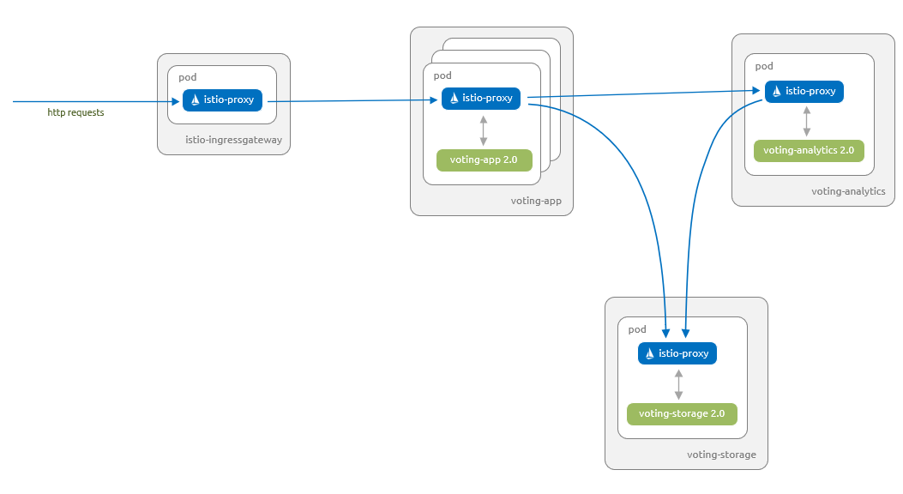

# About this application scenario

The sample AKS voting app provides two voting options (Cats or Dogs) to users. There is a storage component that persists the number of votes for each option. Additionally, there is an analytics component that provides details around the votes cast for each option.

In this application scenario, you start by deploying version 1.0 of the voting app and version 1.0 of the analytics component. The analytics component provides simple counts for the number of votes. The voting app and analytics component interact with version 1.0 of the storage component, which is backed by Redis.

You upgrade the analytics component to version 1.1, which provides counts, and now totals and percentages.

A subset of users test version 2.0 of the app via a canary release. This new version uses a storage component that is backed by a MySQL database.

Once you're confident that version 2.0 works as expected on your subset of users, you roll out version 2.0 to all your users.

# Deploy the application

Let's start by deploying the application into your Azure Kubernetes Service (AKS) cluster. The following diagram shows what runs by the end of this section - version 1.0 of all components with inbound requests serviced via the Istio ingress gateway:


The artifacts you need to follow along with this article are available in the Azure-Samples/aks-voting-app GitHub repo. You can either download the artifacts or clone the repo as follows:

```Console

git clone https://github.com/Azure-Samples/aks-voting-app.git

```

Change to the following folder in the downloaded / cloned repo and run all subsequent steps from this folder:

```Console
cd aks-voting-app/scenarios/intelligent-routing-with-istio
```

First, create a namespace in your AKS cluster for the sample AKS voting app named voting as follows:

```Console
kubectl create namespace voting
```

Label the namespace with istio-injection=enabled. This label instructs Istio to automatically inject the istio-proxies as sidecars into all of your pods in this namespace.

```Console

Copy
kubectl label namespace voting istio-injection=enabled
```

Now let's create the components for the AKS Voting app. Create these components in the voting namespace created in a previous step.

```
# voting-storage-deployment-1.0.yaml
apiVersion: apps/v1
kind: Deployment
metadata:
  name: voting-storage-1-0
spec:
  replicas: 1
  selector:
    matchLabels:
      app: voting-storage
      version: "1.0"
  template:
    metadata:
      labels:
        app: voting-storage
        version: "1.0"
    spec:
      containers:
      - name: voting-storage
        image: redis:4.0.10
        ports:
        - containerPort: 6379
          name: redis
---
# voting-storage-service.yaml
apiVersion: v1
kind: Service
metadata:
  name: voting-storage
  labels:
    app: voting-storage
spec:
  ports:
  - port: 6379
    name: redis
  selector:
    app: voting-storage
---
# voting-analytics-deployment-1.0.yaml
apiVersion: apps/v1
kind: Deployment
metadata:
  name: voting-analytics-1-0
spec:
  replicas: 1
  selector:
    matchLabels:
      app: voting-analytics
      version: "1.0"
  template:
    metadata:
      labels:
        app: voting-analytics
        version: "1.0"
    spec:
      containers:
      - name: voting-analytics
        image: mcr.microsoft.com/aks/samples/voting/analytics:1.0
        imagePullPolicy: Always
        ports:
        - containerPort: 8080
          name: http
        env:
        - name: REDIS_HOST
          value: "voting-storage"
---
# voting-analytics-service.yaml
apiVersion: v1
kind: Service
metadata:
  name: voting-analytics
  labels:
    app: voting-analytics
spec:
  ports:
  - port: 8080
    name: http
  selector:
    app: voting-analytics
---
# voting-app-deployment-1.0.yaml
apiVersion: apps/v1
kind: Deployment
metadata:
  name: voting-app-1-0
spec:
  replicas: 3
  selector:
    matchLabels:
      app: voting-app
      version: "1.0"
  template:
    metadata:
      labels:
        app: voting-app
        version: "1.0"
    spec:
      containers:
      - name: voting-app
        image: mcr.microsoft.com/aks/samples/voting/app:1.0
        imagePullPolicy: Always
        ports:
        - containerPort: 8080
          name: http
        env:
        - name: SHOWDETAILS
          value: "true"
        - name: FEATUREFLAG
          value: "true"
        - name: REDIS_HOST
          value: "voting-storage"
        - name: ANALYTICS_HOST
          value: "voting-analytics"
---
# voting-app-service.yaml
apiVersion: v1
kind: Service
metadata:
  name: voting-app
  labels:
    app: voting-app
spec:
  ports:
  - port: 8080
    name: http
  selector:
    app: voting-app
```

```Console
kubectl apply -f kubernetes/step-1-create-voting-app.yaml --namespace voting
```

The following example output shows the resources being created:

```Output
deployment.apps/voting-storage-1-0 created
service/voting-storage created
deployment.apps/voting-analytics-1-0 created
service/voting-analytics created
deployment.apps/voting-app-1-0 created
service/voting-app created
```

> Note

> Istio has some specific requirements around pods and services. For more information, see the Istio [Requirements for Pods and Services documentation](https://istio.io/docs/setup/kubernetes/prepare/requirements/).

To see the pods that have been created, use the kubectl get pods command as follows:

```Console
kubectl get pods -n voting --show-labels
```

The following example output shows there are three instances of the `voting-app` pod and a single instance of both the `voting-analytics` and voting-storage pods. Each of the pods has two containers. One of these containers is the component, and the other is the `istio-proxy`:

```Output
NAME                                    READY     STATUS    RESTARTS   AGE   LABELS
voting-analytics-1-0-57c7fccb44-ng7dl   2/2       Running   0          39s   app=voting-analytics,pod-template-hash=57c7fccb44,version=1.0
voting-app-1-0-956756fd-d5w7z           2/2       Running   0          39s   app=voting-app,pod-template-hash=956756fd,version=1.0
voting-app-1-0-956756fd-f6h69           2/2       Running   0          39s   app=voting-app,pod-template-hash=956756fd,version=1.0
voting-app-1-0-956756fd-wsxvt           2/2       Running   0          39s   app=voting-app,pod-template-hash=956756fd,version=1.0
voting-storage-1-0-5d8fcc89c4-2jhms     2/2       Running   0          39s   app=voting-storage,pod-template-hash=5d8fcc89c4,version=1.0
```

To see information about the pod, we'll use the [kubectl describe pod](https://kubernetes.io/docs/reference/generated/kubectl/kubectl-commands#describe) command with label selectors to select the voting-analytics pod. We'll filter the output to show the details of the two containers present in the pod:

#### Bash:

```Bash
kubectl describe pod -l "app=voting-analytics, version=1.0" -n voting | egrep "istio-proxy:|voting-analytics:" -A2
```

The `istio-proxy` container has automatically been injected by Istio to manage the network traffic to and from your components, as shown in the following example output:

#### Output:

```Console
  voting-analytics:
    Container ID:   docker://35efa1f31d95ca737ff2e2229ab8fe7d9f2f8a39ac11366008f31287be4cea4d
    Image:          mcr.microsoft.com/aks/samples/voting/analytics:1.0
--
  istio-proxy:
    Container ID:  docker://1fa4eb43e8d4f375058c23cc062084f91c0863015e58eb377276b20c809d43c6
    Image:         docker.io/istio/proxyv2:1.3.2
```

You can't connect to the voting app until you create the Istio [Gateway](https://istio.io/docs/reference/config/networking/v1alpha3/gateway/) and [Virtual Service](https://istio.io/docs/reference/config/networking/v1alpha3/virtual-service/). These Istio resources route traffic from the default Istio ingress gateway to our application.

> Note
> A Gateway is a component at the edge of the service mesh that receives inbound or outbound HTTP and TCP traffic.
>
> A Virtual Service defines a set of routing rules for one or more destination services.

Use the `kubectl apply` command to deploy the Gateway and Virtual Service yaml. Remember to specify the namespace that these resources are deployed into.

```
# voting-app-virtualservice.yaml
apiVersion: networking.istio.io/v1alpha3
kind: VirtualService
metadata:
  name: voting-app
spec:
  hosts:
  - "*"
  gateways:
  - voting-app-gateway
  http:
  - match:
    - uri:
        prefix: /
    route:
    - destination:
        host: voting-app.voting.svc.cluster.local
        port:
          number: 8080
---
# voting-app-gateway.yaml
apiVersion: networking.istio.io/v1alpha3
kind: Gateway
metadata:
  name: voting-app-gateway
spec:
  selector:
    istio: ingressgateway
  servers:
  - port:
      number: 80
      name: http
      protocol: HTTP
    hosts:
    - "*"
```

```Console
kubectl apply -f istio/step-1-create-voting-app-gateway.yaml --namespace voting
```

The following example output shows the new Gateway and Virtual Service being created:

#### Output

```Output
virtualservice.networking.istio.io/voting-app created
gateway.networking.istio.io/voting-app-gateway created
```

Obtain the IP address of the Istio Ingress Gateway using the following command:

```Output
kubectl get service istio-ingressgateway --namespace istio-system -o jsonpath='{.status.loadBalancer.ingress[0].ip}'
```

The following example output shows the IP address of the Ingress Gateway:

```Output
20.188.211.19
```

Open up a browser and paste in the IP address. The sample AKS voting app is displayed.


The information at the bottom of the screen shows that the app uses version 1.0 of voting-app and version 1.0 of `voting-storage` (Redis).

## Update the application

Let's deploy a new version of the analytics component. This new version 1.1 displays totals and percentages in addition to the count for each category.

The following diagram shows what will be running at the end of this section - only version 1.1 of our voting-analytics component has traffic routed from the voting-app component. Even though version 1.0 of our voting-analytics component continues to run and is referenced by the voting-analytics service, the Istio proxies disallow traffic to and from it.


Let's deploy version 1.1 of the voting-analytics component. Create this component in the voting namespace:

```
# voting-analytics-deployment-1.1.yaml
apiVersion: apps/v1
kind: Deployment
metadata:
  name: voting-analytics-1-1
spec:
  replicas: 1
  selector:
    matchLabels:
      app: voting-analytics
      version: "1.1"
  template:
    metadata:
      labels:
        app: voting-analytics
        version: "1.1"
    spec:
      containers:
      - name: voting-analytics
        image: mcr.microsoft.com/aks/samples/voting/analytics:1.1
        imagePullPolicy: Always
        ports:
        - containerPort: 8080
          name: http
        env:
        - name: REDIS_HOST
          value: "voting-storage"


```

#### Bash

```Console
kubectl apply -f kubernetes/step-2-update-voting-analytics-to-1.1.yaml --namespace voting
```

The following example output shows the resources being created:

#### Output

```Output
deployment.apps/voting-analytics-1-1 created
```

Open the sample AKS voting app in a browser again, using the IP address of the Istio Ingress Gateway obtained in the previous step.

Your browser alternates between the two views shown below. Since you are using a Kubernetes Service for the voting-analytics component with only a single label selector (app: voting-analytics), Kubernetes uses the default behavior of round-robin between the pods that match that selector. In this case, it is both version 1.0 and 1.1 of your voting-analytics pods.


You can visualize the switching between the two versions of the voting-analytics component as follows. Remember to use the IP address of your own Istio Ingress Gateway.

#### Bash

```
INGRESS_IP=20.188.211.19
for i in {1..5}; do curl -si $INGRESS_IP | grep results; done
```

The following example output shows the relevant part of the returned web site as the site switches between versions:

#### Output

```
  <div id="results"> Cats: 2 | Dogs: 4 </div>
  <div id="results"> Cats: 2 | Dogs: 4 </div>
  <div id="results"> Cats: 2/6 (33%) | Dogs: 4/6 (67%) </div>
  <div id="results"> Cats: 2 | Dogs: 4 </div>
  <div id="results"> Cats: 2/6 (33%) | Dogs: 4/6 (67%) </div>
```

# Lock down traffic to version 1.1 of the application

Now let's lock down traffic to only version 1.1 of the `voting-analytics` component and to version `1.0` of the `voting-storage` component. You then define routing rules for all of the other components.

- A Virtual Service defines a set of routing rules for one or more destination services.
- A Destination Rule defines traffic policies and version specific policies.
- A Policy defines what authentication methods can be accepted on workload(s).

Use the `kubectl apply` command to replace the Virtual Service definition on your voting-app and add Destination Rules and Virtual Services for the other components. You will add a Policy to the voting namespace to ensure that all communicate between services is secured using mutual TLS and client certificates.

- The Policy has `peers.mtls.mode` set to `STRICT` to ensure that mutual TLS is enforced between your services within the `voting` namespace.

- We also set the trafficPolicy.tls.mode to ISTIO_MUTUAL in all our Destination Rules. Istio provides services with strong identities and secures communications between services using mutual TLS and client certificates that Istio transparently manages.

```
# voting-app-virtualservice-1.0.yaml
apiVersion: networking.istio.io/v1alpha3
kind: VirtualService
metadata:
  name: voting-app
spec:
  hosts:
  - "*"
  gateways:
  - voting-app-gateway
  http:
  - match:
    - uri:
        prefix: /
    route:
    - destination:
        host: voting-app.voting.svc.cluster.local
        subset: v1-0
        port:
          number: 8080
---
apiVersion: "security.istio.io/v1beta1"
kind: "PeerAuthentication"
metadata:
  name: "default"
spec:
  mtls:
    mode: STRICT
---
# voting-app-destinationrule-1.0.yaml
apiVersion: networking.istio.io/v1alpha3
kind: DestinationRule
metadata:
  name: voting-app
spec:
  host: voting-app.voting.svc.cluster.local
  trafficPolicy:
    tls:
      mode: ISTIO_MUTUAL
  subsets:
  - name: v1-0
    labels:
      app: voting-app
      version: "1.0"
---
# voting-analytics-destinationrule-1.0-and-1.1.yaml
apiVersion: networking.istio.io/v1alpha3
kind: DestinationRule
metadata:
  name: voting-analytics
spec:
  host: voting-analytics.voting.svc.cluster.local
  trafficPolicy:
    tls:
      mode: ISTIO_MUTUAL
  subsets:
  - name: v1-0
    labels:
      app: voting-analytics
      version: "1.0"
  - name: v1-1
    labels:
      app: voting-analytics
      version: "1.1"
---
# voting-analytics-virtualservice-1.1.yaml
apiVersion: networking.istio.io/v1alpha3
kind: VirtualService
metadata:
  name: voting-analytics
spec:
  hosts:
  - voting-analytics.voting.svc.cluster.local
  http:
  - match:
    - sourceLabels:
        app: voting-app
        version: "1.0"
    route:
    - destination:
        host: voting-analytics.voting.svc.cluster.local
        subset: v1-1
        port:
          number: 8080
---
# voting-storage-destinationrule-1.0.yaml
apiVersion: networking.istio.io/v1alpha3
kind: DestinationRule
metadata:
  name: voting-storage
spec:
  host: voting-storage.voting.svc.cluster.local
  trafficPolicy:
    tls:
      mode: ISTIO_MUTUAL
  subsets:
  - name: v1-0
    labels:
      app: voting-storage
      version: "1.0"
---
# voting-storage-virtualservice-1.0.yaml
apiVersion: networking.istio.io/v1alpha3
kind: VirtualService
metadata:
  name: voting-storage
spec:
  hosts:
  - voting-storage.voting.svc.cluster.local
  tcp:
  - match:
    - sourceLabels:
        app: voting-app
        version: "1.0"
    route:
    - destination:
        host: voting-storage.voting.svc.cluster.local
        subset: v1-0
        port:
          number: 6379
  - match:
    - sourceLabels:
        app: voting-analytics
        version: "1.1"
    route:
    - destination:
        host: voting-storage.voting.svc.cluster.local
        subset: v1-0
        port:
          number: 6379

```

```Console
kubectl apply -f istio/step-2-update-and-add-routing-for-all-components.yaml --namespace voting
```

The following example output shows the new Policy, Destination Rules, and Virtual Services being updated/created:

#### Output

```
virtualservice.networking.istio.io/voting-app configured
policy.authentication.istio.io/default created
destinationrule.networking.istio.io/voting-app created
destinationrule.networking.istio.io/voting-analytics created
virtualservice.networking.istio.io/voting-analytics created
destinationrule.networking.istio.io/voting-storage created
virtualservice.networking.istio.io/voting-storage created
```

If you open the AKS Voting app in a browser again, only the new version 1.1 of the voting-analytics component is used by the voting-app component.


You can visualize that you are now only routed to version 1.1 of your voting-analytics component as follows. Remember to use the IP address of your own Istio Ingress Gateway:

#### Bash

```
INGRESS_IP=20.188.211.19
for i in {1..5}; do curl -si $INGRESS_IP | grep results; done
```

The following example output shows the relevant part of the returned web site:

#### Output

```
<div id="results"> Cats: 2/6 (33%) | Dogs: 4/6 (67%) </div>
  <div id="results"> Cats: 2/6 (33%) | Dogs: 4/6 (67%) </div>
  <div id="results"> Cats: 2/6 (33%) | Dogs: 4/6 (67%) </div>
  <div id="results"> Cats: 2/6 (33%) | Dogs: 4/6 (67%) </div>
  <div id="results"> Cats: 2/6 (33%) | Dogs: 4/6 (67%) </div>
```

# Roll out a canary release of the application

Now let's deploy a new version 2.0 of the `voting-app`, `voting-analytics`, and `voting-storage` components. The new voting-storage component use MySQL instead of Redis, and the voting-app and voting-analytics components are updated to allow them to use this new voting-storage component.

The `voting-app` component now supports feature flag functionality. This feature flag allows you to test the canary release capability of Istio for a subset of users.

The following diagram shows what you will have running at the end of this section.

- Version 1.0 of the voting-app component, version 1.1 of the voting-analytics component and version 1.0 of the voting-storage component are able to communicate with each other.
- Version 2.0 of the voting-app component, version 2.0 of the voting-analytics component and version 2.0 of the voting-storage component are able to communicate with each other.
- Version 2.0 of the voting-app component are only accessible to users that have a specific feature flag set. This change is managed using a feature flag via a cookie.


First, update the Istio Destination Rules and Virtual Services to cater for these new components. These updates ensure that you don't route traffic incorrectly to the new components and users don't get unexpected access:

```
# voting-app-destinationrule-1.0-and-2.0.yaml
apiVersion: networking.istio.io/v1alpha3
kind: DestinationRule
metadata:
  name: voting-app
spec:
  host: voting-app.voting.svc.cluster.local
  trafficPolicy:
    tls:
      mode: ISTIO_MUTUAL
  subsets:
  - name: v1-0
    labels:
      app: voting-app
      version: "1.0"
  - name: v2-0
    labels:
      app: voting-app
      version: "2.0"
---
# voting-app-virtualservice-1.0-and-2.0.yaml
apiVersion: networking.istio.io/v1alpha3
kind: VirtualService
metadata:
  name: voting-app
spec:
  hosts:
  - "*"
  gateways:
  - voting-app-gateway
  http:
  - match:
    - uri:
        prefix: /
      headers:
        cookie:
          regex: "^(.*?; ?)?(featureflag=on)(;.*)?$"
    route:
    - destination:
        host: voting-app.voting.svc.cluster.local
        subset: v2-0
        port:
          number: 8080
  - match:
    - uri:
        prefix: /
    route:
    - destination:
        host: voting-app.voting.svc.cluster.local
        subset: v1-0
        port:
          number: 8080
---
# voting-analytics-destinationrule-1.1-and-2.0.yaml
apiVersion: networking.istio.io/v1alpha3
kind: DestinationRule
metadata:
  name: voting-analytics
spec:
  host: voting-analytics.voting.svc.cluster.local
  trafficPolicy:
    tls:
      mode: ISTIO_MUTUAL
  subsets:
  - name: v1-1
    labels:
      app: voting-analytics
      version: "1.1"
  - name: v2-0
    labels:
      app: voting-analytics
      version: "2.0"
---
# voting-analytics-virtualservice-1.1-and-2.0.yaml
apiVersion: networking.istio.io/v1alpha3
kind: VirtualService
metadata:
  name: voting-analytics
spec:
  hosts:
  - voting-analytics.voting.svc.cluster.local
  http:
  - match:
    - sourceLabels:
        app: voting-app
        version: "1.0"
    route:
    - destination:
        host: voting-analytics.voting.svc.cluster.local
        subset: v1-1
        port:
          number: 8080
  - match:
    - sourceLabels:
        app: voting-app
        version: "2.0"
    route:
    - destination:
        host: voting-analytics.voting.svc.cluster.local
        subset: v2-0
        port:
          number: 8080
---
# voting-storage-destinationrule-1.0-and-2.0.yaml
apiVersion: networking.istio.io/v1alpha3
kind: DestinationRule
metadata:
  name: voting-storage
spec:
  host: voting-storage.voting.svc.cluster.local
  trafficPolicy:
    tls:
      mode: ISTIO_MUTUAL
  subsets:
  - name: v1-0
    labels:
      app: voting-storage
      version: "1.0"
  - name: v2-0
    labels:
      app: voting-storage
      version: "2.0"
---
# voting-storage-virtualservice-1.0-and-2.0.yaml
apiVersion: networking.istio.io/v1alpha3
kind: VirtualService
metadata:
  name: voting-storage
spec:
  hosts:
  - voting-storage.voting.svc.cluster.local
  tcp:
  - match:
    - sourceLabels:
        app: voting-app
        version: "1.0"
    route:
    - destination:
        host: voting-storage.voting.svc.cluster.local
        subset: v1-0
        port:
          number: 6379
  - match:
    - sourceLabels:
        app: voting-analytics
        version: "1.1"
    route:
    - destination:
        host: voting-storage.voting.svc.cluster.local
        subset: v1-0
        port:
          number: 6379
  - match:
    - sourceLabels:
        app: voting-app
        version: "2.0"
    route:
    - destination:
        host: voting-storage.voting.svc.cluster.local
        subset: v2-0
        port:
          number: 3306
  - match:
    - sourceLabels:
        app: voting-analytics
        version: "2.0"
    route:
    - destination:
        host: voting-storage.voting.svc.cluster.local
        subset: v2-0
        port:
          number: 3306

```

```Console
kubectl apply -f istio/step-3-add-routing-for-2.0-components.yaml --namespace voting
```

The following example output shows the Destination Rules and Virtual Services being updated:

#### Output

```
destinationrule.networking.istio.io/voting-app configured
virtualservice.networking.istio.io/voting-app configured
destinationrule.networking.istio.io/voting-analytics configured
virtualservice.networking.istio.io/voting-analytics configured
destinationrule.networking.istio.io/voting-storage configured
virtualservice.networking.istio.io/voting-storage configured
```

Next, let's add the Kubernetes objects for the new version 2.0 components. You also update the voting-storage service to include the 3306 port for MySQL:

```
# voting-storage-service-add-mysql.yaml
apiVersion: v1
kind: Service
metadata:
  name: voting-storage
  labels:
    app: voting-storage
spec:
  ports:
  - port: 6379
    name: redis
  - port: 3306
    name: mysql
  selector:
    app: voting-storage
---
# voting-storage-secret.yaml
apiVersion: v1
kind: Secret
metadata:
  name: voting-storage-secret
type: Opaque
data:
  MYSQL_USER: ZGJ1c2Vy
  MYSQL_PASSWORD: UGFzc3dvcmQxMg==
  MYSQL_DATABASE: YXp1cmV2b3Rl
  MYSQL_ROOT_PASSWORD: UGFzc3dvcmQxMg==
---
# voting-storage-deployment-2.0.yaml
apiVersion: apps/v1
kind: Deployment
metadata:
  name: voting-storage-2-0
spec:
  replicas: 1
  selector:
    matchLabels:
      app: voting-storage
      version: "2.0"
  template:
    metadata:
      labels:
        app: voting-storage
        version: "2.0"
    spec:
      containers:
      - name: voting-storage
        image: mcr.microsoft.com/aks/samples/voting/storage:2.0
        args: ["--ignore-db-dir=lost+found"]
        ports:
        - containerPort: 3306
          name: mysql
        volumeMounts:
        - name: mysql-persistent-storage
          mountPath: /var/lib/mysql
        env:
        - name: MYSQL_ROOT_PASSWORD
          valueFrom:
            secretKeyRef:
              name: voting-storage-secret
              key: MYSQL_ROOT_PASSWORD
        - name: MYSQL_USER
          valueFrom:
            secretKeyRef:
              name: voting-storage-secret
              key: MYSQL_USER
        - name: MYSQL_PASSWORD
          valueFrom:
            secretKeyRef:
              name: voting-storage-secret
              key: MYSQL_PASSWORD
        - name: MYSQL_DATABASE
          valueFrom:
            secretKeyRef:
              name: voting-storage-secret
              key: MYSQL_DATABASE
      volumes:
      - name: mysql-persistent-storage
        persistentVolumeClaim:
          claimName: mysql-pv-claim
---
apiVersion: v1
kind: PersistentVolumeClaim
metadata:
  name: mysql-pv-claim
spec:
  accessModes:
  - ReadWriteOnce
  resources:
    requests:
      storage: 1Gi
---
# voting-analytics-deployment-2.0.yaml
apiVersion: apps/v1
kind: Deployment
metadata:
  name: voting-analytics-2-0
spec:
  replicas: 1
  selector:
    matchLabels:
      app: voting-analytics
      version: "2.0"
  template:
    metadata:
      labels:
        app: voting-analytics
        version: "2.0"
    spec:
      containers:
      - name: voting-analytics
        image: mcr.microsoft.com/aks/samples/voting/analytics:2.0
        imagePullPolicy: Always
        ports:
        - containerPort: 8080
          name: http
        env:
        - name: MYSQL_HOST
          value: "voting-storage"
        - name: MYSQL_USER
          valueFrom:
            secretKeyRef:
              name: voting-storage-secret
              key: MYSQL_USER
        - name: MYSQL_PASSWORD
          valueFrom:
            secretKeyRef:
              name: voting-storage-secret
              key: MYSQL_PASSWORD
        - name: MYSQL_DATABASE
          valueFrom:
            secretKeyRef:
              name: voting-storage-secret
              key: MYSQL_DATABASE
---
# voting-app-deployment-2.0.yaml
apiVersion: apps/v1
kind: Deployment
metadata:
  name: voting-app-2-0
spec:
  replicas: 3
  selector:
    matchLabels:
      app: voting-app
      version: "2.0"
  template:
    metadata:
      labels:
        app: voting-app
        version: "2.0"
    spec:
      containers:
      - name: voting-app
        image: mcr.microsoft.com/aks/samples/voting/app:2.0
        imagePullPolicy: Always
        ports:
        - containerPort: 8080
          name: http
        env:
        - name: SHOWDETAILS
          value: "true"
        - name: FEATUREFLAG
          value: "true"
        - name: MYSQL_HOST
          value: "voting-storage"
        - name: MYSQL_USER
          valueFrom:
            secretKeyRef:
              name: voting-storage-secret
              key: MYSQL_USER
        - name: MYSQL_PASSWORD
          valueFrom:
            secretKeyRef:
              name: voting-storage-secret
              key: MYSQL_PASSWORD
        - name: MYSQL_DATABASE
          valueFrom:
            secretKeyRef:
              name: voting-storage-secret
              key: MYSQL_DATABASE
        - name: ANALYTICS_HOST
          value: "voting-analytics"

```

```Console
kubectl apply -f kubernetes/step-3-update-voting-app-with-new-storage.yaml --namespace voting
```

The following example output shows the Kubernetes objects are successfully updated or created:

#### Output

```
service/voting-storage configured
secret/voting-storage-secret created
deployment.apps/voting-storage-2-0 created
persistentvolumeclaim/mysql-pv-claim created
deployment.apps/voting-analytics-2-0 created
deployment.apps/voting-app-2-0 created
```

Wait until all the version 2.0 pods are running. Use the kubectl get pods command with the -w watch switch to watch for changes on all pods in the voting namespace:

```Console
kubectl get pods --namespace voting -w
```

You should now be able to switch between the version 1.0 and version 2.0 (canary) of the voting application. The feature flag toggle at the bottom of the screen sets a cookie. This cookie is used by the voting-app Virtual Service to route users to the new version 2.0.


The vote counts are different between the versions of the app. This difference highlights that you are using two different storage backends.

# Finalize the rollout

Once you've successfully tested the canary release, update the voting-app Virtual Service to route all traffic to version 2.0 of the voting-app component. All users then see version 2.0 of the application, regardless of whether the feature flag is set or not:

Diagram that shows that users see version 2.0 of the application, regardless of whether the feature flag is set or not.


Update all the Destination Rules to remove the versions of the components you no longer want active. Then, update all the Virtual Services to stop referencing those versions.

Since there's no longer any traffic to any of the older versions of the components, you can now safely delete all the deployments for those components.

The AKS Voting app components and routing.


You have now successfully rolled out a new version of the AKS Voting App.

## Clean up

You can remove the AKS voting app we used in this scenario from your AKS cluster by deleting the voting namespace as follows:

```Console
kubectl delete namespace voting
```

The following example output shows that all the components of the AKS voting app have been removed from your AKS cluster.

#### Output
```
namespace "voting" deleted

```


